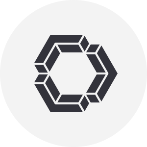

<div align="center">


<br/>

# 🚀 OmniRoute — Darmowa bramka AI


</div>

<div align="center">

# 💰 ~1,4 mld darmowych tokenów / miesiąc

</div>

> Ręczne łączenie darmowych pakietów jest uciążliwe — dziesiątki SDK, dziesiątki limitów zapytań (rate limits) i brak wiedzy, ile tak naprawdę Ci pozostało. OmniRoute agreguje **udokumentowane** darmowe pakiety z **39 pul dostawców / ponad 460 modeli** w jedną rzetelną liczbę i wyświetla ją na żywo w panelu (`/dashboard/free-tiers`).


> Animowane podsumowanie strony `/dashboard/free-tiers` na żywo. Pełna metodologia (deduplikacja pul, pakiety kredytów, warunki dostawców): **[docs/reference/FREE_TIERS.md](../../../docs/reference/FREE_TIERS.md)**.
>
> <sub>Liczby te są ponownie weryfikowane co dwa tygodnie na podstawie aktualnego katalogu i **mogą się zmieniać w obie strony** — gdy dostawca kończy darmowy pakiet, liczba spada; gdy pojawia się nowy, rośnie. Publikujemy to, co faktycznie oblicza katalog, nigdy zaokrąglony w górę, optymistyczny wariant. Bramka CI (`check:docs-counts`) powoduje błąd budowania projektu, jeśli nagłówek rozbiega się z kodem.</sub>

<div align="center">

<h3>

⭐ Dodaj gwiazdkę do repozytorium, jeśli OMNIROUTE pomógł Ci zaoszczędzić pieniądze i ułatwił pracę.

</h3>

[](https://github.com/diegosouzapw/OmniRoute)
<a href="https://trendshift.io/repositories/23589" target="_blank"></a>
[](https://www.star-history.com/diegosouzapw/omniroute)

<br/>

### 💬 Dołącz do społeczności

[](https://discord.gg/U47eFqAXCn)
[](https://t.me/omnirouteOficial)
[](https://chat.whatsapp.com/JI7cDQ1GyaiDHhVBpLxf8b?mode=gi_t)
[](https://chat.whatsapp.com/LTSpdFhXTxjH4R6CCNiKWz)
[](https://omniroute.online)

**Pytania, wskazówki dotyczące dostawców, plany rozwoju (roadmap) i wsparcie → [Discord](https://discord.gg/U47eFqAXCn) · [Telegram](https://t.me/omnirouteOficial) · WhatsApp [🌍 Global](https://chat.whatsapp.com/JI7cDQ1GyaiDHhVBpLxf8b?mode=gi_t) / [🇧🇷 Brasil](https://chat.whatsapp.com/LTSpdFhXTxjH4R6CCNiKWz)**

<br/>

### 🧩 Dostępne

[](https://www.npmjs.com/package/omniroute)

[](https://hub.docker.com/r/diegosouzapw/omniroute)
[](../../../LICENSE)


[**🚀 Szybki start**](#-szybki-start) • [**🎯 Komba**](#-komba-combos--flagowa-funkcja) • [**🌐 Dostawcy**](#-268-dostawc%C3%B3w-ai--ponad-90-darmowych) • [**🔌 CLI & MCP**](#-pe%C5%82ne-cli--a2a-i-mcp) • [**🗜️ Kompresja**](#%EF%B8%8F-oszcz%C4%99dzaj-1595-token%C3%B3w--automatycznie) • [**🌍 Strona WWW**](https://omniroute.online)

[💥 Obietnica](#-obietnica) • [🤔 Dlaczego](#-dlaczego-omniroute) • [🏆 Co wyróżnia OmniRoute](#-co-wyr%C3%B3%C5%BCnia-omniroute) • [🤖 Zgodne CLI](#-zgodne-cli-i-agenci-koduj%C4%85cy) • [🖥️ Gdzie to działa](#%EF%B8%8F-gdzie-dzia%C5%82a-omniroute--wsz%C4%99dzie) • [🔒 Prywatność](#-prywatno%C5%9B%C4%87-i-lokalne-dzia%C5%82anie-local-first) • [🎬 W akcji](#-omniroute-w-akcji) • [📸 Zrzuty ekranu](#-zrzuty-ekranu-z-panelu) • [📧 Wsparcie](#-wsparcie-i-spo%C5%82eczno%C5%9B%C4%87)

</div>

<div align="center">
 <b>🌐 W 43 językach</b>
 <table>
  <tr>
    <td align="center"><a href="../../../README.md">🇺🇸</a></td>
    <td align="center"><a href="../pt-BR/README.md">🇧🇷</a></td>
    <td align="center"><a href="../pt/README.md">🇵🇹</a></td>
    <td align="center"><a href="../es/README.md">🇪🇸</a></td>
    <td align="center"><a href="../fr/README.md">🇫🇷</a></td>
    <td align="center"><a href="../it/README.md">🇮🇹</a></td>
    <td align="center"><a href="../de/README.md">🇩🇪</a></td>
    <td align="center"><a href="../nl/README.md">🇳🇱</a></td>
    <td align="center"><a href="../ru/README.md">🇷🇺</a></td>
    <td align="center"><a href="../uk-UA/README.md">🇺🇦</a></td>
    <td align="center"><a href="README.md">🇵🇱</a></td>
    <td align="center"><a href="../cs/README.md">🇨🇿</a></td>
    <td align="center"><a href="../sk/README.md">🇸🇰</a></td>
    <td align="center"><a href="../ro/README.md">🇷🇴</a></td>
    <td align="center"><a href="../hu/README.md">🇭🇺</a></td>
  </tr>
  <tr>
    <td align="center"><a href="../bg/README.md">🇧🇬</a></td>
    <td align="center"><a href="../da/README.md">🇩🇰</a></td>
    <td align="center"><a href="../fi/README.md">🇫🇮</a></td>
    <td align="center"><a href="../no/README.md">🇳🇴</a></td>
    <td align="center"><a href="../sv/README.md">🇸🇪</a></td>
    <td align="center"><a href="../zh-CN/README.md">🇨🇳</a></td>
    <td align="center"><a href="../zh-TW/README.md">🇹🇼</a></td>
    <td align="center"><a href="../ja/README.md">🇯🇵</a></td>
    <td align="center"><a href="../ko/README.md">🇰🇷</a></td>
    <td align="center"><a href="../th/README.md">🇹🇭</a></td>
    <td align="center"><a href="../vi/README.md">🇻🇳</a></td>
    <td align="center"><a href="../id/README.md">🇮🇩</a></td>
    <td align="center"><a href="../ms/README.md">🇲🇾</a></td>
    <td align="center"><a href="../phi/README.md">🇵🇭</a></td>
  </tr>
  <tr>
    <td align="center"><a href="../in/README.md">🇮🇳</a></td>
    <td align="center"><a href="../hi/README.md">🇮🇳</a></td>
    <td align="center"><a href="../gu/README.md">🇮🇳</a></td>
    <td align="center"><a href="../mr/README.md">🇮🇳</a></td>
    <td align="center"><a href="../ta/README.md">🇮🇳</a></td>
    <td align="center"><a href="../te/README.md">🇮🇳</a></td>
    <td align="center"><a href="../bn/README.md">🇧🇩</a></td>
    <td align="center"><a href="../ur/README.md">🇵🇰</a></td>
    <td align="center"><a href="../fa/README.md">🇮🇷</a></td>
    <td align="center"><a href="../ar/README.md">🇸🇦</a></td>
    <td align="center"><a href="../he/README.md">🇮🇱</a></td>
    <td align="center"><a href="../tr/README.md">🇹🇷</a></td>
    <td align="center"><a href="../az/README.md">🇦🇿</a></td>
    <td align="center"><a href="../sw/README.md">🇹🇿</a></td>
  </tr>
</table>
</div>

<div align="center">

# 💥 Obietnica

</div>


<br/>
<br/>

<div align="center">

# 🤔 Dlaczego OmniRoute?

</div>


<div align="center">


</div>

<br/>

<div align="center">

# 🎯 Komba (Combos) — Flagowa funkcja

</div>

> **Kombo** to łańcuch modeli, po których OmniRoute nawiguje **automatycznie**. Wybucha limit, dostawca ulega awarii lub koszty gwałtownie rosną — kombo bezgłośnie przełącza się na kolejny model. **To właśnie sprawia, że OmniRoute jest niezawodny.** 🛡️

### ⚡ Zero konfiguracji — po prostu użyj `auto`

Nie musisz tworzyć żadnego komba. Ustaw swój model na `auto` (lub jego wariant), a OmniRoute zbuduje wirtualne kombo z Twoich połączonych dostawców, oceniane na żywo:

| Identyfikator modelu | Pod kątem czego optymalizuje                                                                                                                         |
| -------------------- | ---------------------------------------------------------------------------------------------------------------------------------------------------- |
| `auto`               | 🎯 Zbalansowana wartość domyślna (LKGP — trzyma się ostatniego dobrego dostawcy)                                                                     |
| `auto/coding`        | 🧑‍💻 Wagi zorientowane na jakość przy generowaniu kodu                                                                                               |
| `auto/fast`          | ⚡ W pierwszej kolejności najniższe opóźnienia                                                                                                       |
| `auto/cheap`         | 💰 W pierwszej kolejności najtańsze za token                                                                                                         |
| `auto/offline`       | 🔋 W pierwszej kolejności największy zapas limitu (quota / rate-limit)                                                                               |
| `auto/smart`         | 🔭 Najpierw jakość + 10% eksploracji w celu odkrycia lepszych modeli                                                                                 |


### 🔀 Albo zbuduj własne — 18 strategii routingu

Wszystkie **18** strategii — łącz i dopasowuj na każdym kroku komba:

| #   | Strategia           | Co robi                                                                                                                  |
| --- | ------------------- | ------------------------------------------------------------------------------------------------------------------------ |
| 1   | `priority`          | Uporządkowana lista według priorytetu — zużyj każdy cel przed przejściem do kolejnego 🥇                                 |
| 2   | `fill-first`        | Wypełnij całkowicie limit każdego celu przed pójściem dalej                                                              |
| 3   | `weighted`          | Wybór losowy ważony według wagi przypisanej do celu                                                                      |
| 4   | `round-robin`       | Przechodzenie przez cele po kolei (Round-Robin)                                                                          |
| 5   | `p2c`               | Losowe równoważenie obciążenia metodą "wybierz dwa, weź lepszy" (P2C)                                                    |
| 6   | `least-used`        | Wybierz cel o najniższym aktualnym obciążeniu                                                                            |
| 7   | `random`            | Jednolity losowy wybór (ze skreśleniem powtórzeń)                                                                        |
| 8   | `strict-random`     | Losowo bez usuwania duplikatów 🎲                                                                                        |
| 9   | `cost-optimized`    | Minimalizuj koszt w USD za zapytanie na podstawie cennika w katalogu na żywo 💸                                           |
| 10  | `headroom`          | Wybierz cel z największym pozostałym limitem                                                                             |
| 11  | `reset-window`      | Preferuj cel, którego okno limitu resetuje się najszybciej                                                               |
| 12  | `reset-aware`       | Klasyfikuj według czasu resetu limitu — najpierw krótkie okna 📊                                                         |
| 13  | `context-relay`     | Przekazuj kontekst między celami przy długich rozmowach 🧠                                                               |
| 14  | `context-optimized` | Wybierz cel najlepiej dopasowany do bieżącego rozmiaru kontekstu                                                         |
| 15  | `lkgp`              | Ostatnia znana dobra ścieżka (LKGP) — trzyma się ostatniego udanego celu                                                 |
| 16  | `auto`              | Ocenianie na żywo na podstawie 12 czynników dla każdego połączenia 🤖                                                   |
| 17  | `fusion`            | Rozesłanie zapytania do panelu modeli + sędzia syntetyzuje jedną odpowiedź (Fusion) 🧬                                   |
| 18  | `pipeline`          | Łączenie kroków — wyjście każdego celu zasila kolejny 🔗                                                                 |


<sub>Silnik Auto-Combo ocenia każdego kandydata na podstawie **12 czynników** (stan techniczny, limit, koszt, opóźnienie, wskaźnik sukcesu, aktualność…) — zobacz [`docs/routing/AUTO-COMBO.md`](docs/routing/AUTO-COMBO.md).</sub>


### ⚖️ Quota-Share — podziel jedną subskrypcję w zespole ✨ NOWOŚĆ

> Uruchamiasz kilka kluczy na tym **samym koncie nadrzędnym** (jeden plan Codex Pro, jeden klucz Kimi, jedno stanowisko GLM Coding)? Nagły skok zużycia na jednym kluczu może wyczerpać cały 5-godzinny / godzinny limit i zablokować wszystkich innych. **Quota-Share** rozdziela limit czasowy dostawcy **sprawiedliwie** pomiędzy klucze w puli — a dzięki zasadzie _oszczędzania pracy (work-conserving)_, nieużywana część limitu bezczynnego członka jest wypożyczana innym, zamiast się marnować.

| Suwak / Opcja | Co kontroluje |
| ------------------------ | ----------------------------------------------------------------------------------------------------------------------------------------------------------------------------- |
| ⚖️ **Waga alokacji** | udział każdego klucza w puli — np. `50 / 30 / 20`                                                                                                                            |
| 📐 **Wymiary** | śledzenie `%` · zapytań · tokenów · `$`, w oknie **5h / 7d / na model**                                                                                                       |
| 🚦 **Polityka** | `hard` (blokuj po przekroczeniu) · `soft` (obniż priorytet) · `burst` (użyj wolnego zapasu)                                                                                               |
| 🧱 **Limit max (Cap)** | bezwzględny limit na klucz, niezależny od trybu                                                                                                                                 |



<sub>Wymuszane na "gorącej ścieżce" **zanim** żądanie opuści OmniRoute, z limitami na parę (klucz, model) + zachowaniem sesyjności (session stickiness) dla spójności pamięci podręcznej promptów (teraz z przełącznikiem wyłączania dla komba / globalnie). 📖 [Silnik Quota Sharing](../../../docs/routing/QUOTA_SHARE.md)</sub>


### 🧱 Odporność jest wbudowana (3 niezależne warstwy)


<sub>📖 [Silnik Auto-Combo](docs/routing/AUTO-COMBO.md) · [Podręcznik odporności](../../../docs/architecture/RESILIENCE_GUIDE.md)</sub>

<br/>

<div align="center">

# 🏆 Co wyróżnia OmniRoute

</div>

| Funkcja | OmniRoute | Inne routery |
| -------------------------------------- | ------------------------------------------------------------------- | ------------- |
| 🌐 Dostawcy | **268** | 20–100 |
| 🆓 Darmowi dostawcy | **90+ (40+ darmowych na zawsze)** | 1–5 |
| 🔀 Strategie routingu | **18** (priorytetowa, ważona, zoptymalizowana pod kątem kosztów, przekazywanie kontekstu, fusion…) | 1–3 |
| 🗜️ Kompresja tokenów | **Kaskadowa RTK + Caveman (15–95%)** | Brak / 20–40% |
| 🧰 Wbudowany serwer MCP | **104 narzędzia, 3 protokoły transportowe, 31 zakresów** | Rzadkość |
| 🤝 Protokół agenta A2A | **6 umiejętności, JSON-RPC 2.0** | Brak |
| 🧠 Pamięć (FTS5 + wektorowa) | **Tak** | Rzadkość |
| 🛡️ Barierki ochronne (PII, wstrzykiwanie promptów, wizja) | **Tak** | Rzadkość |
| ☁️ Agenci chmurowi | **Codex, Cursor, Devin, Jules** | Brak |
| 🥷 Maskowanie sygnatury TLS | **JA3/JA4 przez wreq-js** | Brak |
| 🖥️ Wieloplatformowość | **Web · Desktop · Termux · PWA** | Tylko Web |
| 🌍 i18n (lokalizacja) | **43 języki** | 0–4 |

<sub>📊 Szczegółowe porównanie z LiteLLM, OpenRouter i Portkey → [`docs/comparison/OMNIROUTE_VS_ALTERNATIVES.md`](../../../docs/comparison/OMNIROUTE_VS_ALTERNATIVES.md)</sub>

<br/>

<div align="center">

# ✨ Co nowego

</div>

> Najważniejsze nowości z wersji **v3.8.20 → v3.8.49**. Pełna historia w [`CHANGELOG.md`](CHANGELOG.md).

- **🗜️ Wzmocnienie kompresji** — domyślnie włączone zabezpieczenie przed nadmiernym rozrostem (inflation guard), pakiety Caveman dla DE / FR / JA + chińskiego (wényán), filtry RTK dla Gradle i .NET. → [Kompresja](../../../docs/compression/COMPRESSION_ENGINES.md)
- **💸 Rzetelny koszt ryczałtowy** — dostawcy subskrypcyjni / planów kodowania wykazują koszt **0 USD** w analityce; budżet, limit i routing nadal działają szacunkowo. → [Referencja API](docs/reference/API_REFERENCE.md)
- **⚖️ Routing Quota-Share** — podział obciążenia kont według _dostępnego limitu_: harmonogramowanie DRR, współbieżność na połączenie, wielookienkowe pule, zachowanie sesyjności (session stickiness). → [Podręcznik odporności](../../../docs/architecture/RESILIENCE_GUIDE.md)
- **🤖 Konfiguracja CLI/agenta jednym poleceniem** — `setup-*` konfiguruje ponad 12 narzędzi programistycznych; `omniroute launch` / `launch-codex` działają bez konfiguracji. → [Integracje CLI](../../../docs/guides/CLI-INTEGRATIONS.md)
- **🛰️ Tryb zdalny** — steruj zdalną instancją OmniRoute za pomocą tokenów o ograniczonym zakresie (`connect` / `contexts` / `tokens`) + pomocnika OAuth `antigravity` dla instalacji na VPS. → [Tryb zdalny](../../../docs/guides/REMOTE-MODE.md)
- **🧭 Inteligentniejszy auto-routing** — komba `auto/<kategoria>:<poziom>`, **Fusion** (panel modeli + sędzia), routing uwzględniający specyfikę zadania, nadpisywanie modelu / trybu / budżetu USD per żądanie. → [Auto-Combo](docs/routing/AUTO-COMBO.md)
- **🗜️ Wtyczkowa kompresja** — 11 modułowych silników + Studia Kompresji: LLMLingua-2, dwupoziomowy Ultra, omniglyph, weryfikacja dokładności (fidelity gate) na każdym kroku, GCF v3.2, edytor z przeciąganiem elementów. → [Kompresja](../../../docs/compression/COMPRESSION_ENGINES.md)
- **🕵️ Przezroczyste dekodowanie MITM (TPROXY)** — przechwytywanie CLI ignorujących zmienne środowiskowe proxy, z instalatorem CA per-SNI i bazy zaufanych certyfikatów. → [MITM/TPROXY](../../../docs/security/MITM-TPROXY-DECRYPT.md)
- **💸 Telemetria kosztów wszędzie** — nagłówki kosztu/użycia `X-OmniRoute-*` w każdym punkcie końcowym, nagłówek oszczędności z trafień w cache (cache-HIT), limity wydatków USD na klucz. → [Referencja API](docs/reference/API_REFERENCE.md)
- **🧠 Pamięć pod Twoją kontrolą** — domyślnie wyłączona, opcjonalna kwantyzacja wektorowa int8 + stopniowe wygaszanie (typed decay), nagłówek `x-omniroute-no-memory` na żądanie. → [Pamięć](../../../docs/frameworks/MEMORY.md)
- **🛡️ Bezpieczeństwo** — ochrona przed wstrzykiwaniem promptów (prompt-injection guard) na każdej trasie LLM (zestaw testów red-team) + darmowe wyszukiwanie w sieci DuckDuckGo jako ostatnia deska ratunku. → [Barierki ochronne](../../../docs/security/GUARDRAILS.md)
- **🖼️ Nowe punkty końcowe** — `/v1/ocr` (Mistral OCR) i `/v1/audio/translations` (w stylu Whisper) uzupełniają obsługę multimediów. → [Referencja API](docs/reference/API_REFERENCE.md)
- **🌍 Wdrożenie i administracja** — `basePath` dla reverse-proxy, automatyczne wykrywanie języka przeglądarki, śledzenie urządzeń na klucz, zaufanie MITM bez uprawnień roota, lokalizacja zh-TW. → [Środowisko](docs/reference/ENVIRONMENT.md)
- **🤝 Więcej dostawców i agentów** — Cursor Cloud Agent, Grok Build (xAI), pełnoprawna karta Ollama, Claude Sonnet 5, Zed, Requesty, SenseNova, Yuanbao… oraz odświeżony katalog 250 dostawców. → [Dostawcy](../../../docs/reference/PROVIDER_REFERENCE.md)
- **⚡ Lokalna wydajność i infrastruktura** — uruchamianie lokalnego Redis jednym kliknięciem, instalatory przekaźników dla Cloudflare Workers / Deno Deploy, Bifrost i Mux jako nadzorowane usługi wbudowane. → [Usługi wbudowane](../../../docs/frameworks/EMBEDDED-SERVICES.md)

<br/>

<div align="center">

# 🤖 Zgodne CLI i agenci kodujący

> Jedna konfiguracja — `http://localhost:20128/v1` — i **każde** IDE lub CLI AI działa na darmowych i tanich modelach.

<div align="center">
<table>
  <tr>
    <td align="center" width="76"><a href="https://github.com/anthropics/claude-code"><br/><sub><b>Claude Code</b></sub><br/><sub>                           </sub></a></td>
    <td align="center" width="76"><a href="https://github.com/openai/codex"><br/><sub><b>Codex CLI</b></sub><br/><sub>                           </sub></a></td>
    <td align="center" width="76"><picture><source media="(prefers-color-scheme:dark)" srcset="https://cdn.jsdelivr.net/npm/@lobehub/icons-static-png@1.91.0/dark/cline.png"/></picture><br/><sub><b>Cline</b></sub><br/><sub>                           </sub></td>
    <td align="center" width="76"><a href="https://github.com/Kilo-Org/kilocode"><br/><sub><b>Kilo Code</b></sub><br/><sub>                           </sub></a></td>
    <td align="center" width="76"><br/><sub><b>Roo Code</b></sub><br/><sub>                           </sub></td>
    <td align="center" width="76"><br/><sub><b>Continue</b></sub><br/><sub>                           </sub></td>
    <td align="center" width="76"><br/><sub><b>Qwen Code</b></sub><br/><sub>                           </sub></td>
    <td align="center" width="76"><br/><sub><b>Aider</b></sub><br/><sub>                           </sub></td>
    <td align="center" width="76"><br/><sub><b>ForgeCode</b></sub><br/><sub>                           </sub></td>
  </tr>
  <tr>
    <td align="center" width="76"><br/><sub><b>jcode</b></sub><br/><sub>                           </sub></td>
    <td align="center" width="76"><br/><sub><b>DeepSeek TUI</b></sub><br/><sub>                           </sub></td>
    <td align="center" width="76"><br/><sub><b>CodeWhale</b></sub><br/><sub>                           </sub></td>
    <td align="center" width="76"><a href="https://github.com/anomalyco/opencode"><picture><source media="(prefers-color-scheme:dark)" srcset="https://cdn.jsdelivr.net/npm/@lobehub/icons-static-png@1.91.0/dark/opencode.png"/></picture><br/><sub><b>OpenCode</b></sub><br/><sub>                           </sub></a></td>
    <td align="center" width="76"><br/><sub><b>Factory Droid</b></sub><br/><sub>                           </sub></td>
    <td align="center" width="76"><br/><sub><b>Copilot CLI</b></sub><br/><sub>                           </sub></td>
    <td align="center" width="76"><br/><sub><b>Cursor CLI</b></sub><br/><sub>                           </sub></td>
    <td align="center" width="76"><br/><sub><b>Smelt</b></sub><br/><sub>                           </sub></td>
  </tr>
  <tr>
    <td align="center" width="76"><br/><sub><b>Pi</b></sub><br/><sub>                           </sub></td>
    <td align="center" width="76"><br/><sub><b>Grok Build</b></sub><br/><sub>                           </sub></td>
    <td align="center" width="76"><picture><source media="(prefers-color-scheme:dark)" srcset="https://cdn.jsdelivr.net/npm/@lobehub/icons-static-png@1.91.0/dark/nousresearch.png"/></picture><br/><sub><b>Hermes Agent</b></sub><br/><sub>                           </sub></td>
    <td align="center" width="76"><br/><sub><b>OpenClaw</b></sub><br/><sub>                           </sub></td>
    <td align="center" width="76"><picture><source media="(prefers-color-scheme:dark)" srcset="https://cdn.jsdelivr.net/npm/@lobehub/icons-static-png@1.91.0/dark/goose.png"/></picture><br/><sub><b>Goose</b></sub><br/><sub>                           </sub></td>
    <td align="center" width="76"><br/><sub><b>Open Interpreter</b></sub><br/><sub>                           </sub></td>
    <td align="center" width="76"><br/><sub><b>Warp AI</b></sub><br/><sub>                           </sub></td>
    <td align="center" width="76"><br/><sub><b>Agent Deck</b></sub><br/><sub>                           </sub></td>
  </tr>
</table>
</div>

<div align="center">
<b>＋ działa również z</b> · Kiro · Command Code · Antigravity · Windsurf · AMP · <b>dowolnym narzędziem kompatybilnym z OpenAI</b>
</div>

<sub>📖 Konfiguracja per narzędzie dla wszystkich 33 narzędzi (25 z CLI Code + 8 z CLI Agents) → [`docs/reference/CLI-TOOLS.md`](docs/reference/CLI-TOOLS.md) · 🧩 Wtyczka OpenCode → [`@omniroute/opencode-provider`](https://www.npmjs.com/package/@omniroute/opencode-provider)</sub>

</div>

<br/>

<div align="center">

# 🌐 268 dostawców AI — ponad 90 darmowych

</div>

> Najbardziej kompletny katalog spośród wszystkich routerów open-source: **268 dostawców**, **ponad 90 z darmowym pakietem**, **ponad 40 darmowych na zawsze**.

<div align="center">

### 🏢 Każde główne laboratorium — przez jeden punkt końcowy

<table>
  <tr>
    <td align="center" width="98"><picture><source media="(prefers-color-scheme:dark)" srcset="https://cdn.jsdelivr.net/npm/@lobehub/icons-static-png@1.91.0/dark/openai.png"/></picture><br/><sub>OpenAI</sub><br/><sub>                           </sub></td>
    <td align="center" width="98"><br/><sub>Anthropic</sub><br/><sub>                           </sub></td>
    <td align="center" width="98"><br/><sub>Gemini</sub><br/><sub>                           </sub></td>
    <td align="center" width="98"><picture><source media="(prefers-color-scheme:dark)" srcset="https://cdn.jsdelivr.net/npm/@lobehub/icons-static-png@1.91.0/dark/grok.png"/></picture><br/><sub>xAI Grok</sub><br/><sub>                           </sub></td>
    <td align="center" width="98"><br/><sub>DeepSeek</sub><br/><sub>                           </sub></td>
    <td align="center" width="98"><br/><sub>Mistral</sub><br/><sub>                           </sub></td>
    <td align="center" width="98"><br/><sub>Qwen</sub><br/><sub>                           </sub></td>
    <td align="center" width="98"><br/><sub>Meta Llama</sub><br/><sub>                           </sub></td>
    <td align="center" width="98"><picture><source media="(prefers-color-scheme:dark)" srcset="https://cdn.jsdelivr.net/npm/@lobehub/icons-static-png@1.91.0/dark/groq.png"/></picture><br/><sub>Groq</sub><br/><sub>                           </sub></td>
  </tr>
  <tr>
    <td align="center" width="98"><br/><sub>NVIDIA</sub><br/><sub>                           </sub></td>
    <td align="center" width="98"><br/><sub>MiniMax</sub><br/><sub>                           </sub></td>
    <td align="center" width="98"><br/><sub>Cohere</sub><br/><sub>                           </sub></td>
    <td align="center" width="98"><br/><sub>Perplexity</sub><br/><sub>                           </sub></td>
    <td align="center" width="98"><br/><sub>HuggingFace</sub><br/><sub>                           </sub></td>
    <td align="center" width="98"><br/><sub>Together</sub><br/><sub>                           </sub></td>
    <td align="center" width="98"><br/><sub>Fireworks</sub><br/><sub>                           </sub></td>
    <td align="center" width="98"><br/><sub>Cloudflare</sub><br/><sub>                           </sub></td>
    <td align="center" width="98"><br/><sub>Baidu</sub><br/><sub>                           </sub></td>
  </tr>
</table>

<sub>…oraz ponad 220 innych — każda ikona ładuje się na żywo z katalogu dostawców w panelu. 📖 [Referencja dostawców](../../../docs/reference/PROVIDER_REFERENCE.md)</sub>

<br/>

### 🆓 Darmowe na zawsze — 0 USD, bez karty

<table>
  <tr>
    <td align="center" width="127"><br/><b>AgentRouter</b><br/><sub>GPT-5, Claude, Gemini<br/>100 USD darmowych kredytów</sub><br/><sub>                                     </sub></td>
    <td align="center" width="127"><br/><b>Qoder AI</b><br/><sub>Kimi-K2, DeepSeek-R1<br/>Nielimitowane DARMOWE</sub><br/><sub>                                     </sub></td>
    <td align="center" width="127"><picture><source media="(prefers-color-scheme:dark)" srcset="https://cdn.jsdelivr.net/npm/@lobehub/icons-static-png@1.91.0/dark/pollinations.png"/></picture><br/><b>Pollinations</b><br/><sub>GPT-5, Claude, Llama 4<br/>Klucz nie jest wymagany</sub><br/><sub>                                     </sub></td>
    <td align="center" width="127"><br/><b>LongCat</b><br/><sub>LongCat-2.0<br/>10M tokenów jednorazowo (KYC) 🔑</sub><br/><sub>                                     </sub></td>
    <td align="center" width="127"><br/><b>Cloudflare AI</b><br/><sub>Ponad 50 modeli<br/>10K neuronów/dzień</sub><br/><sub>                                     </sub></td>
    <td align="center" width="127"><br/><b>NVIDIA NIM</b><br/><sub>129 modeli<br/>~40 RPM darmowo</sub><br/><sub>                                     </sub></td>
    <td align="center" width="127"><br/><b>Cerebras</b><br/><sub>Qwen3 235B<br/>1M tokenów/dzień</sub><br/><sub>                                     </sub></td>
  </tr>
</table>

📖 Pełny katalog w formacie czytelnym dla maszyn → [`docs/reference/PROVIDER_REFERENCE.md`](../../../docs/reference/PROVIDER_REFERENCE.md)

<br/>
</div>

<div align="center">

# 🖥️ Gdzie działa OmniRoute — wszędzie

</div>

> Ta sama aplikacja, Twoja maszyna, Twoje zasady. Od globalnej instalacji przez npm po Twój telefon za pomocą Termux.

| Platforma | Instalacja | Najważniejsze cechy |
| ------------------------- | ---------------------------------------- | --------------------------------------------------------- |
| 📦 **npm (globalnie)** | `npm install -g omniroute` | Jedno polecenie, dowolny system operacyjny |
| 🐳 **Docker** | `docker run … diegosouzapw/omniroute` | Wielonatywność architektur **AMD64 + ARM64** |
| 🖥️ **Desktop (Electron)** | `npm run electron:build` | Natywne okno + zasobnik systemowy (system tray) — **Windows / macOS / Linux** |
| 💪 **ARM** | natywnie `arm64` | Raspberry Pi, serwery ARM, Apple Silicon |
| 📱 **Android (Termux)** | `pkg install nodejs && npx -y omniroute` | Działa **na Twoim telefonie**, 24/7, bez roota |
| 📲 **PWA** | "Dodaj do ekranu głównego" | Pełny ekran, offline, instalacja z poziomu przeglądarki |
| 🧩 **Wtyczka OpenCode** | `@omniroute/opencode-provider` | Natywna integracja z OpenCode |
| 🛠️ **Ze źródeł** | `npm install && npm run dev` | Modyfikuj kod, współtwórz projekt |

<sub>📖 [Podręcznik Docker](../../../docs/guides/DOCKER_GUIDE.md) · [Desktop](../../../electron/README.md) · [Termux](../../../docs/guides/TERMUX_GUIDE.md) · [PWA](../../../docs/guides/PWA_GUIDE.md) · [OpenCode](../../../docs/frameworks/OPENCODE.md)</sub>

<br/>

<div align="center">

# 🔒 Prywatność i lokalne działanie (Local-First)

</div>


<sub>📖 [Autoryzacja](../../../docs/architecture/AUTHZ_GUIDE.md) · [Barierki ochronne](../../../docs/security/GUARDRAILS.md) · [Zgodność](../../../docs/security/COMPLIANCE.md)</sub>

<br/>

<div align="center">

# 🔌 Pełne CLI + A2A i MCP

</div>

> OmniRoute to nie tylko serwer — to **kompletny kokpit w wierszu poleceń** z **ponad 80 poleceniami**, plus otwarte protokoły agentów, dzięki którym agent AI może samodzielnie sterować OmniRoute.

### ⌨️ Prawdziwe CLI (nie tylko `start`)

```bash
omniroute               # uruchom bramkę + panel (port 20128)
omniroute chat          # interaktywny klient czatu TUI (polecenia ukośnika: /model /combo /skill /memory)
omniroute setup         # kreator pierwszej konfiguracji
omniroute doctor        # diagnozuj dostawców, porty, natywne zależności
```

### 🛰️ Tryb zdalny — uruchom CLI lokalnie, OmniRoute na VPS

OmniRoute na serwerze? Steruj nim ze swojego laptopa za pomocą **tego samego CLI**. Zaloguj się raz
za pomocą tokenu dostępu o ograniczonym zakresie; każde kolejne polecenie będzie skierowane do zdalnej maszyny.

```bash
omniroute connect 192.168.0.15            # hasło → token o ograniczonym zakresie, zapisany jako kontekst
omniroute models list                     # ← działa na ZDALNYM serwerze
omniroute configure codex                 # ← wybiera zdalny model, zapisuje lokalny profil Codex
omniroute tokens create --name ci --scope read   # generuj węższe tokeny dla innych maszyn
omniroute contexts use default            # ← przełącz z powrotem na serwer lokalny
```

Tokeny mają zakresy `read` / `write` / `admin`; trasy uruchamiające procesy pozostają ograniczone do pętli zwrotnej (loopback-only).
<sub>📖 [Tryb zdalny](../../../docs/guides/REMOTE-MODE.md)</sub>

<div align="center">



</div>

### 🤝 Połącz agenta — i pozwól mu kontrolować samo OmniRoute

Udostępnij OmniRoute przez **MCP** lub **A2A**, a każdy zdolny do tego agent autonomicznie otrzyma klucze do całej bramki — routingu, dostawców, kombinacji (combos), pamięci podręcznej, kompresji i pamięci.

| Protokół | Punkt końcowy | Zastosowanie |
| ------------------ | ----------------------------------------------- | ------------------------------------------------------- |
| 🧰 **MCP (stdio)** | `omniroute --mcp`                               | Podłącz do Claude Desktop, Cursor, dowolnego klienta MCP |
| 🌊 **MCP (HTTP)** | `http://localhost:20128/api/mcp/stream`         | Zdalny MCP — **104 narzędzia**, 31 zakresów, pełna ścieżka audytu |
| 📡 **MCP (SSE)** | `http://localhost:20128/api/mcp/sse`            | Strumieniowy transport MCP |
| 🤝 **A2A** | `http://localhost:20128/.well-known/agent.json` | Komunikacja agent-do-agenta, **JSON-RPC 2.0** + SSE, 6 umiejętności |

```bash
# Daj Claude Code pełny zestaw narzędzi OmniRoute przez MCP:
claude mcp add-server omniroute --type http --url http://localhost:20128/api/mcp/stream
```

<sub>📖 [Serwer MCP](docs/frameworks/MCP-SERVER.md) · [Serwer A2A](docs/frameworks/A2A-SERVER.md) · [Protokoły agentów](../../../docs/frameworks/AGENT_PROTOCOLS_GUIDE.md)</sub>

<br/>

<div align="center">

# 🗜️ Oszczędzaj 15–95% tokenów — automatycznie

</div>

> **Po co używać wielu tokenów, skoro kilka wystarczy?** Każde żądanie przechodzi przez potok kompresji OmniRoute w sposób **przezroczysty** — bez zmian po stronie klienta. Jest to teraz **stos 11 modułowych silników**, które działają po kolei i mogą być dowolnie łączone w ramach każdego komba routingu — bazując na pomysłach z [RTK](https://github.com/rtk-ai/rtk), [Caveman](https://github.com/JuliusBrussee/caveman) (⭐ 90k+), [LLMLingua-2](https://github.com/microsoft/LLMLingua) i [Troglodita](https://github.com/leninejunior/troglodita) (PT-BR).

### 🧱 Stos 11 silników

Silniki działają w kolejności potoku; każdy z nich można niezależnie włączać i konfigurować dla poszczególnych komb:

| #   | Silnik | Co robi |
| --- | ----------------- | ----------------------------------------------------------------------------------------------------------------------- |
| 1   | **Session-Dedup** | Odrzuca treści powtarzające się między kolejnymi turami (adresowane treścią, międzyturowe) |
| 2   | **CCR** | Archiwizuje duże bloki pod znacznikami pobierania, pobieranymi na żądanie |
| 3   | **RTK** | Inteligentne filtrowanie, deduplikacja i skracanie wyników narzędzi (z uwzględnieniem poleceń) |
| 4   | **Headroom** | Bezstratne upakowanie tabelaryczne jednorodnych tablic JSON, płaskich lub zagnieżdżonych (~30%), poprzez wbudowany kodek **GCF** (specyfikacja v3.2) |
| 5   | **Relevance** | Ekstrakcyjne ocenianie zdań pod kątem dopasowania do ostatniego zapytania użytkownika |
| 6   | **Caveman** | Kompresja prozy oparta na regułach (~65–75% na wyjściu) |
| 7   | **LLMLingua-2** | Semantyczne przycinanie oparte na uczeniu maszynowym przez MobileBERT ONNX — bezpieczne dla kodu, asynchroniczne |
| 8   | **Lite** | Usuwanie białych znaków i skracanie adresów URL obrazów (lekki pod kątem opóżeń punkt odniesienia) |
| 9   | **Aggressive** | Streszczanie + stopniowe "starzenie" starych tur |
| 10  | **Ultra** | Heurystyczne przycinanie tokenów z opcjonalnym poziomem małego modelu (SLM) |

Bloki kodu, adresy URL i dane strukturyzowane są **zawsze zachowywane** z dokładnością co do bajtu. Presety uruchamiane jednym kliknięciem łączą te silniki:

| Tryb | Oszczędności | Najlepszy do |
| ------------------------------ | ---------- | ----------------------------------------------------------------------------------------------------------------------------------------------- |
| 🪶 **Lite** | ~15% | Zawsze włączona bezpieczna opcja domyślna |
| 🪨 **Standard (Caveman)** | ~30% | Codzienne kodowanie |
| ⚡ **Aggressive** | ~50% | Długie sesje z intensywnym użyciem narzędzi |
| 🔥 **Ultra** | ~75% | Maksymalne oszczędności |
| 🧰 **RTK** | 60–90% | Dane wyjściowe z terminala/testów/budowania/git |
| 🔗 **Kaskadowa (RTK → Caveman)** | **78–95%** | Mieszane prompty + logi z narzędzi |

**Rzeczywisty przykład — tryb Standard:**

> **Przed (69 tokenów):** _"The reason your React component is re-rendering is likely because you're creating a new object reference on each render cycle. When you pass an inline object as a prop, React's shallow comparison sees it as a different object every time, which triggers a re-render. I would recommend using useMemo to memoize the object."_
>
> **Po (19 tokenów):** _"New object ref each render. Inline object prop = new ref = re-render. Wrap in useMemo."_
>
> **Ta sama odpowiedź. 72% mniej tokenów. Zero utraty dokładności. ✅**

**Przykład w PT-BR — tryb [Troglodita](https://github.com/leninejunior/troglodita):**

> **Antes (42 tokens):** _"O problema é que o componente está re-renderizando porque uma nova referência de objeto está sendo criada em cada ciclo de renderização. Eu recomendaria usar useMemo."_
>
> **Depois (12 tokens):** _"Re-render: ref nova cada ciclo (objeto inline recriado). Usar `useMemo`."_
>
> **Ta sama odpowiedź. ~70% mniej tokenów. Dokładność techniczna nienaruszona. ✅**

<br/>

### 📖 Jak to działa — potok, architektura i matematyka oszczędności



Domyślne kaskadowe kombo uruchamia `RTK → Caveman`. Gdy oba silniki działają na tym samym ładunku narzędzia/kontekstu, oszczędności się kumulują:

```txt
combined = 1 − (1 − RTK) × (1 − Caveman_input)
average  = 1 − (1 − 0.80) × (1 − 0.46) = 89.2%
range    = 78.4 – 94.6%
```

Bloki kodu, adresy URL, JSON i dane strukturyzowane są **zawsze chronione** przez silnik zachowania integralności.

### 🎚️ Poza silnikami — style wyjściowe, pokrętło adaptacyjne i kontrola per żądanie

Opisane wyżej silniki zmniejszają dane wejściowe. Trzy dodatkowe warstwy kształtują jak, kiedy i co trafia na wyjście:

- **🪄 Style wyjściowe** (sterowanie osią wyjściową) — wstrzykiwanie deterministycznych, bezpiecznych dla cache instrukcji kształtowania odpowiedzi; można je łączyć, każda o intensywności `lite` / `full` / `ultra`. Dodanie stylu to jednolinijkowy wpis w rejestrze:
  - **Zwiezła proza** — odrzucanie wypełniaczy / przedimków / asekuracyjnych sformułowań; zachowanie dokładnej treści technicznej.
  - **Mniej kodu** — podejście "leniwego seniora" (YAGNI): najmniejsza działająca zmiana, bez nieproszonych struktur kodu.
  - **Zwięzły CJK (文言)** — klasyczny, ultra-zwięzły styl chiński (ograniczony lokalizacyjnie do języka `zh`).
- **🎯 Adaptacyjny budżet kontekstu** (pokrętło) — zamiast jednego sztywnego progu włączenia/wyłączenia, uruchamia najtańsze i najbardziej bezstratne silniki tylko w takim stopniu, w jakim jest to konieczne, aby zmieścić się w oknie kontekstowym modelu. Polityka: `reserve-output` (domyślna, dopasowana do modelu) · `percentage` · `absolute`. Tryb: `floor` (gwarantowane dopasowanie) · `replace-autotrigger` (wygrywa Twój wyraźny wybór) · `off` (stary próg).
- **🛞 Miejsce decyzji o kompresji** (priorytet od najwyższego do najniższego) — nagłówek `x-omniroute-compression` w żądaniu › nadpisanie w kombie routingu › aktywny profil nazwany › adaptacyjny / automatyczny wyzwalacz › domyślne ustawienie panelu › wyłączone. Zastosowany plan jest zwracany w nagłówku odpowiedzi `X-OmniRoute-Compression: <tryb>; source=<źródło>`.

Wyzwalaj automatycznie według progu tokenów, włącz pokrętło adaptacyjne, przypnij nazwany profil, ustaw jednorazowo dla żądania lub przypisz potok do komba routingu — cokolwiek pasuje do Twojego obciążenia pracy. Opcjonalne środowisko testowe offline (`npm run eval:compression`) ocenia wierność vs oszczędności na przypisanym korpusie przed wdrożeniem zmian.

📖 [`COMPRESSION_GUIDE.md`](../../../docs/compression/COMPRESSION_GUIDE.md) · [`RTK_COMPRESSION.md`](../../../docs/compression/RTK_COMPRESSION.md) · [`COMPRESSION_ENGINES.md`](../../../docs/compression/COMPRESSION_ENGINES.md)

<br/>

<div align="center">

# ⚡ Szybki start

</div>

**1) Zainstaluj i uruchom**

```bash
npm install -g omniroute
omniroute
```

Panel pod adresem `http://localhost:20128` · API pod adresem `http://localhost:20128/v1`.

**2) Podłącz DARMOWEGO dostawcę (bez rejestracji)**

Panel → **Dostawcy** (Providers) → połącz **Kiro AI** (darmowy Claude, ~50 kredytów/miesiąc na konto) lub **OpenCode Free** (bez autoryzacji) → gotowe.

**3) Skieruj swoje narzędzie do kodowania**

```txt
Base URL: http://localhost:20128/v1
API Key:  [skopiuj z Panel → Endpoints]
Model:    auto            (inteligentny routing bez konfiguracji — lub dowolny dostawca/model)
```

**4) Sprawdź, czy działa**

```bash
curl http://localhost:20128/v1/models -H "Authorization: Bearer TWÓJ_KLUCZ"
```

Powinieneś zobaczyć listę połączonych modeli. 🎉 To wszystko — zacznij kodować, a OmniRoute automatycznie zajmie się routingiem i przełączaniem awaryjnym.

Jeśli Twój klient nie może wysyłać niestandardowych nagłówków, OmniRoute udostępnia również stokenizowane aliasy zgodności:

```txt
OpenAI catalog:   http://localhost:20128/vscode/TWÓJ_KLUCZ/
OpenAI models:    http://localhost:20128/vscode/TWÓJ_KLUCZ/models
OpenAI chat:      http://localhost:20128/vscode/TWÓJ_KLUCZ/chat/completions
OpenAI responses: http://localhost:20128/vscode/TWÓJ_KLUCZ/responses
Ollama chat:      http://localhost:20128/vscode/TWÓJ_KLUCZ/api/chat
Ollama tags:      http://localhost:20128/vscode/TWÓJ_KLUCZ/api/tags
```

Używaj ich tylko w przypadku klientów, którzy nie mogą dołączyć nagłówka `Authorization: Bearer ...`. Autoryzacja przez nagłówek pozostaje preferowanym trybem.

<br/>

## 📦 Więcej metod instalacji — Docker, źródła, pnpm, Arch

**🐳 Docker**

```bash
docker run -d --name omniroute --restart unless-stopped --stop-timeout 40 \
  -p 20128:20128 -v omniroute-data:/app/data diegosouzapw/omniroute:latest
```

**🛠️ Ze źródeł**

```bash
cp .env.example .env && npm install
PORT=20128 npm run dev
```

**📦 pnpm**

```bash
pnpm add -g omniroute@latest --allow-build=better-sqlite3 --allow-build=@swc/core && omniroute
```

**🐧 Arch Linux (AUR)**

```bash
yay -S omniroute-bin && systemctl --user enable --now omniroute.service
```

**🔧 Nix (Flake)**

```bash
# Używając Nix flakes
nix develop
npm run dev

# Lub używając devbox
devbox run npm run dev
```

📖 [Podręcznik Docker](../../../docs/guides/DOCKER_GUIDE.md) — Profile Compose, HTTPS przez Caddy, tunele Cloudflare.

**🦭 Podman**

```bash
# 1. Zbuduj obraz
podman build --target runner-base -t omniroute:base .

# 2. Napraw uprawnienia katalogu danych dla Podmana bez roota
mkdir -p data && podman unshare chown 1000:1000 ./data

# 3. Ustaw środowisko wykonawcze w .env, a następnie uruchom (zobacz contrib/podman/ dla Quadlet)
echo "CONTAINER_HOST=podman" >> .env
podman compose --profile base up -d
```

📖 [Podręcznik Podman](../../../contrib/podman/README.md) — Integracja Quadlet z systemd, podman-compose, Quadlet.

**⚡ Szybsza / lżejsza instalacja (pomiń budowanie natywne)**

Natywny silnik SQLite (`better-sqlite3`) jest zależnością **opcjonalną**, więc globalna instalacja nigdy nie blokuje się na kompilacji ze źródeł: używa prekompilowanego pliku binarnego, jeśli pasuje do Twojej platformy/Node, a w przeciwnym razie przezroczyście przełącza się na silnik czystego JS (`node:sqlite` na Node 22+, w przeciwnym razie dołączony `sql.js` WASM) — nie są wymagane żadne narzędzia budowania.

Aby całkowicie pominąć natywne przygotowanie po instalacji (CI, tryb bezgłowy/headless lub wolne maszyny):

```bash
OMNIROUTE_SKIP_POSTINSTALL=1 npm install -g omniroute   # CI=1 również to pomija
```

W celu uzyskania najszybszej instalacji preferuj **pnpm** (magazyn adresowany treścią + twarde dowiązania — patrz wyżej). Dla środowiska bez panelu graficznego (headless) użyj profilu Docker `base` (powyżej) lub podręcznika Termux. CLI i panel webowy są obsługiwane przez ten sam proces na jednym porcie, więc obecnie nie ma osobnego pakietu wyłącznie z CLI.

<br/>

<div align="center">

# 🎬 OmniRoute w akcji

</div>

<div align="center">
<table>
  <tr>
    <td align="center" width="280">
      <a href="https://www.youtube.com/watch?v=Rxdc36yUyOQ"></a><br/>
      <b>🇧🇷 Português</b><br/><sub>Pełny przewodnik</sub>
    </td>
    <td align="center" width="280">
      <a href="https://www.youtube.com/watch?v=CMzyOiUyEVc"></a><br/>
      <b>🇺🇸 English</b><br/><sub>Pełne omówienie</sub>
    </td>
    <td align="center" width="280">
      <a href="https://www.youtube.com/watch?v=il_5Ii6v4-Y"></a><br/>
      <b>🇷🇺 Русский</b><br/><sub>Pełny przewodnik</sub>
    </td>
  </tr>
</table>
</div>

<div align="center">

> 🎬 **Nagrałeś film o OmniRoute?** Otwórz [zgłoszenie (issue)](https://github.com/diegosouzapw/OmniRoute/issues/new) lub [dyskusję (discussion)](https://github.com/diegosouzapw/OmniRoute/discussions) z linkiem — umieścimy go tutaj.

<br/>
</div>

<div align="center">

# 📸 Zrzuty ekranu z panelu

</div>

| Strona | Zrzut ekranu | Strona | Zrzut ekranu |
| ---------- | ------------------------------------------------- | ---------- | --------------------------------------------- |
| Dostawcy |  | Komba |  |
| Analityka |  | Stan techniczny |  |
| Tłumacz |  | Ustawienia |  |
| Narzędzia CLI |  | Logi użycia |  |

<br/>

<div align="center">

# 📧 Wsparcie i społeczność

> 💬 **Rozmawiaj ze społecznością** — linki do Discorda, Telegrama i WhatsAppa (🌍 / 🇧🇷) znajdują się na [górze tego pliku README](#-do%C5%82%C4%85cz-do-spo%C5%82eczno%C5%9Bci).

- 🌍 **Strona internetowa**: [omniroute.online](https://omniroute.online)
- 🐙 **GitHub**: [github.com/diegosouzapw/OmniRoute](https://github.com/diegosouzapw/OmniRoute)
- 🐛 **Zgłoszenia (Issues)**: [zgłoś błąd](https://github.com/diegosouzapw/OmniRoute/issues) (dołącz wynik działania komendy `npm run system-info`)
- 🤝 **Współtworzenie**: zobacz [CONTRIBUTING.md](CONTRIBUTING.md) lub wybierz zadanie typu `good first issue`

</div>

---

<br/>
<div align="center">

## 🛠️ Stos technologiczny

</div>

- **Środowisko uruchomieniowe**: Node.js 22.x lub 24.x LTS (zalecane 24 LTS) — `>=22.22.2 <23 || >=24.0.0 <27`
- **Język**: TypeScript 6.0 — **100% TypeScript** w `src/` oraz `open-sse/` (zero typów `any` w modułach rdzenia od wersji v2.0)
- **Framework**: Next.js 16 + React 19 + Tailwind CSS 4
- **Baza danych**: better-sqlite3 (SQLite) + LowDB (spuścizna JSON) — stan domeny, logi proxy, audyt MCP, decyzje o routingu, pamięć, umiejętności
- **Schematy**: Zod (walidacja wejścia/wyjścia narzędzi MCP, kontrakty API)
- **Protokoły**: MCP (stdio/HTTP) + A2A v0.3 (JSON-RPC 2.0 + SSE)
- **Strumieniowanie**: Server-Sent Events (SSE) + most WebSocket (`/v1/ws`)
- **Uwierzytelnianie**: OAuth 2.0 (PKCE) + JWT + Klucze API + Autoryzacja zakresów MCP
- **Testowanie**: Node.js test runner + Vitest (**ponad 25 000 przypadków testowych** w ponad 3300 plikach — jednostkowe, integracyjne, E2E, bezpieczeństwo, ekosystem)
- **Platformy**: Desktop (Electron), Android (Termux), PWA (dowolna przeglądarka)
- **CI/CD**: GitHub Actions (automatyczna publikacja w npm + Docker Hub przy wydaniu wersji)
- **Strona WWW**: [omniroute.online](https://omniroute.online)
- **Pakiet**: [npmjs.com/package/omniroute](https://www.npmjs.com/package/omniroute)
- **Docker**: [hub.docker.com/r/diegosouzapw/omniroute](https://hub.docker.com/r/diegosouzapw/omniroute)
- **Odporność**: Wyłącznik awaryjny (circuit breaker), wykładnicze opóźnienie (exponential backoff), ochrona przed kumulacją zapytań (anti-thundering herd), podszywanie się pod TLS, samonaprawiające się auto-kombo

<div align="center">

<br/>

## 📖 Dokumentacja

</div>

### 📘 Wprowadzenie

| Dokument | Opis |
| -------------------------------------------------------------- | ------------------------------------------------------------------------------------------------------------------------------------------------------------------------------------ |
| [Podręcznik użytkownika](docs/guides/USER_GUIDE.md) | Dostawcy, komba, integracja CLI, wdrażanie |
| [Podręcznik instalacji](../../../docs/guides/SETUP_GUIDE.md) | Pełne metody instalacji, konfiguracje narzędzi CLI, konfiguracja protokołów, dostrajanie limitów czasu (timeout) |
| [Podręcznik narzędzi CLI](docs/reference/CLI-TOOLS.md) | Konfiguracja per narzędzie dla Claude Code, Codex, Cursor, Cline, OpenClaw, Kilo, Copilot |
| [Tryb zdalny](../../../docs/guides/REMOTE-MODE.md) | Steruj zdalnym OmniRoute (VPS) z poziomu CLI na swoim laptopie za pomocą tokenów o ograniczonym zakresie |
| [Konfiguracja Claude Code](../../../docs/guides/CLAUDE-CODE-CONFIGURATION.md) | Skieruj Claude Code na OmniRoute (lokalnie/zdalnie) za pomocą polecenia launch + profili dla poszczególnych modeli |
| [Szybki start](#-szybki-start) | 3-krokowa instalacja → połącz → skonfiguruj |

### 🔧 Administracja i wdrażanie

| Dokument | Opis |
| -------------------------------------------------------- | ----------------------------------------------------------------------------------------------------------------------------------------------------------------------------------- |
| [Podręcznik Docker](../../../docs/guides/DOCKER_GUIDE.md) | Uruchamianie w Dockerze, profile Compose, HTTPS przez Caddy, tunele, tagi obrazów |
| [Podręcznik Podman](../../../contrib/podman/README.md) | Integracja Quadlet z systemd, podman-compose, SELinux |
| [Wdrożenie na VM](docs/ops/VM_DEPLOYMENT_GUIDE.md) | Pełny poradnik: konfiguracja VM + nginx + Cloudflare |
| [Wdrożenie na Fly.io](docs/ops/FLY_IO_DEPLOYMENT_GUIDE.md) | Wdrażanie na Fly.io z trwałą pamięcią masową |
| [Podręcznik Termux](../../../docs/guides/TERMUX_GUIDE.md) | Uruchamianie OmniRoute na systemie Android za pomocą Termux |
| [Podręcznik PWA](../../../docs/guides/PWA_GUIDE.md) | Instalacja Progressive Web App, buforowanie, architektura |
| [Podręcznik odinstalowywania](docs/guides/UNINSTALL.md) | Czyste usuwanie dla wszystkich metod instalacji |
| [Konfiguracja środowiska](docs/reference/ENVIRONMENT.md) | Pełny wykaz zmiennych .env i referencji |

### 🧠 Funkcje i architektura

| Dokument | Opis |
| ---------------------------------------------------------------------------- | ---------------------------------------------------------------------------------------------------------------------------------- |
| [Architektura](docs/architecture/ARCHITECTURE.md) | Architektura systemu, przepływ danych i mechanizmy wewnętrzne |
| [Podręcznik kompresji](../../../docs/compression/COMPRESSION_GUIDE.md) | 7-opcjowy potok: wyłączona / lite / standard / aggressive / ultra / RTK / kaskadowa |
| [Kompresja RTK](../../../docs/compression/RTK_COMPRESSION.md) | Kompresja danych wyjściowych komend, filtry, zaufanie, weryfikacja, odzyskiwanie surowego wyjścia |
| [Silniki kompresji](../../../docs/compression/COMPRESSION_ENGINES.md) | Caveman, RTK, potoki kaskadowe, interfejsy panelu/API/MCP |
| [Format reguł kompresji](../../../docs/compression/COMPRESSION_RULES_FORMAT.md) | Schematy JSON pakietów reguł dla filtrów Caveman i RTK |
| [Pakiety językowe kompresji](../../../docs/compression/COMPRESSION_LANGUAGE_PACKS.md) | Wykrywanie języka i tworzenie pakietów reguł Caveman |
| [Podręcznik odporności](../../../docs/architecture/RESILIENCE_GUIDE.md) | Wyłączniki awaryjne, czasy schładzania, kolejka, ochrona przed kumulacją zapytań, podszywanie się pod TLS |
| [Silnik Auto-Combo](docs/routing/AUTO-COMBO.md) | Ocenianie na bazie 12 czynników, pakiety trybów, samonaprawianie |
| [Podręcznik proxy](../../../docs/ops/PROXY_GUIDE.md) | 3-poziomowy system proxy, rynek 1proxy, rejestr CRUD |
| [Darmowe poziomy](../../../docs/reference/FREE_TIERS.md) | Skonsolidowany katalog ponad 25 darmowych dostawców API |
| [Galeria funkcji](docs/guides/FEATURES.md) | Wizualny przegląd panelu ze zrzutami ekranu |
| [Dokumentacja kodu źródłowego](docs/architecture/CODEBASE_DOCUMENTATION.md) | Przyjazne dla początkujących omówienie bazy kodu |

### 🤖 Protokoły i API

| Dokument | Opis |
| ------------------------------------------------- | --------------------------------------------------------------------------------------------------------------------------------------------------------------------------------------- |
| [Referencja API](docs/reference/API_REFERENCE.md) | Wszystkie punkty końcowe z przykładami |
| [Specyfikacja OpenAPI](../../../docs/openapi.yaml) | Specyfikacja OpenAPI 3.0 |
| [Serwer MCP](../../../open-sse/mcp-server/README.md) | 104 narzędzia MCP, konfiguracje IDE, klienci Python/TS/Go |
| [Podręcznik serwera MCP](docs/frameworks/MCP-SERVER.md) | Instalacja MCP, protokoły transportowe i referencja narzędzi |
| [Serwer A2A](../../../src/lib/a2a/README.md) | Protokół JSON-RPC 2.0, umiejętności, strumieniowanie, zarządzanie zadaniami |
| [Podręcznik serwera A2A](docs/frameworks/A2A-SERVER.md) | Karta agenta A2A, zadania, umiejętności i strumieniowanie |

### 📋 Projekt i Jakość

| Dokument | Opis |
| -------------------------------------------------- | ---------------------------------------------------------------------------------------------------------------------------------------------------------------------------------------- |
| [Współtworzenie](CONTRIBUTING.md) | Konfiguracja środowiska deweloperskiego i wytyczne |
| [Dziennik zmian](CHANGELOG.md) | Pełna historia wydań dla każdej wersji |
| [Polityka bezpieczeństwa](SECURITY.md) | Zgłaszanie podatności i praktyki bezpieczeństwa |
| [Podręcznik i18n](docs/guides/I18N.md) | Obsługa ponad 40 języków, przepływ tłumaczeń, kierunek tekstu RTL |
| [Lista kontrolna wydania](docs/ops/RELEASE_CHECKLIST.md) | Kroki walidacji przedwydaniowej |
| [Plan pokrycia testami](docs/ops/COVERAGE_PLAN.md) | Strategia pokrycia testami i zestaw ponad 25 000 testów |

<br/>

<div align="center">

# ⭐ Główni autorzy

> OmniRoute jest kształtowane przez pasjonatów ze społeczności open-source. Te osoby wniosły wyjątkowy wkład, który bezpośrednio wpływa na jakość, stabilność i zasięg projektu. **Dziękujemy.**

<table>
  <tr>
    <td align="center" width="160">
      <a href="https://github.com/oyi77">
        <br/>
        <b>oyi77</b>
      </a><br/>
      <sub>🥇 207 commits • +114K lines</sub><br/>
      <sub>Silnik analityczny, agregacje SQL,<br/>rynek proxy, pokrycie testami</sub>
    </td>
    <td align="center" width="160">
      <a href="https://github.com/rdself">
        <br/>
        <b>R.D. &amp; Randi</b>
      </a><br/>
      <sub>🥈 108 commits • +38K lines</sub><br/>
      <sub>Strona punktów końcowych, integracje tuneli,<br/>przepływy pracy Docker, status A2A, interfejs kompresji</sub>
    </td>
    <td align="center" width="160">
      <a href="https://github.com/christopher-s">
        <br/>
        <b>Chris Staley</b>
      </a><br/>
      <sub>🥉 70 commits • +1.8K lines</sub><br/>
      <sub>Wzmocnienie strumienia SSE, API Responses,<br/>stronicowanie Gemini, poprawki regresji testów</sub>
    </td>
    <td align="center" width="160">
      <a href="https://github.com/zen0bit">
        <br/>
        <b>zenobit</b>
      </a><br/>
      <sub>🏅 62 commits • +22K lines</sub><br/>
      <sub>Potok CI/CD, i18n dla 33 języków,<br/>pakiet dla Void Linux, poprawki platformy</sub>
    </td>
    <td align="center" width="160">
      <a href="https://github.com/JxnLexn">
        <br/>
        <b>Jan Leon</b>
      </a><br/>
      <sub>🏅 52 commits • +22K lines</sub><br/>
      <sub>Routing uwzględniający moc rozumowania, kontrola proxy,<br/>widoczność limitów, kompresja Live Zone</sub>
    </td>
  </tr>
  <tr>
    <td align="center" width="160">
      <a href="https://github.com/chirag127">
        <br/>
        <b>Chirag Singhal</b>
      </a><br/>
      <sub>🏅 46 commits • +4.8K lines</sub><br/>
      <sub>Oczyszczanie błędów, poprawka autouzupełniania MITM,<br/>sędzia fusion, poprawność obsługi wyłącznika awaryjnego/429</sub>
    </td>
    <td align="center" width="160">
      <a href="https://github.com/backryun">
        <br/>
        <b>backryun</b>
      </a><br/>
      <sub>🏅 43 commits • +70K lines</sub><br/>
      <sub>Utrzymanie katalogu dostawców — aktualizacje dla Perplexity, Kimi,<br/>Cerebras, Copilot, LMArena</sub>
    </td>
    <td align="center" width="160">
      <a href="https://github.com/kfiramar">
        <br/>
        <b>kfiramar</b>
      </a><br/>
      <sub>🏅 38 commits • +1.7K lines</sub><br/>
      <sub>Obsługa websocket i passthrough dla Codex, autoryzacja/onboarding,<br/>wzmocnienie Electron, migracje baz danych</sub>
    </td>
    <td align="center" width="160">
      <a href="https://github.com/benzntech">
        <br/>
        <b>Benson K B</b>
      </a><br/>
      <sub>🏅 28 commits • +9.2K lines</sub><br/>
      <sub>Aplikacja desktopowa Electron, automatyczny instalator aktualizacji,<br/>przepływy budowania wydań, wieloplatformowe CI</sub>
    </td>
    <td align="center" width="160">
      <a href="https://github.com/herjarsa">
        <br/>
        <b>Hernan J. Ardila</b>
      </a><br/>
      <sub>🏅 22 commits • +174K lines</sub><br/>
      <sub>Komba o zerowym opóźnieniu, auto-routing mostu wizyjnego,<br/>długość kontekstu w katalogu, wskazówki odporności dla błędów 429</sub>
    </td>
  </tr>
</table>

> 🙏 Funkcje, poprawki błędów i ulepszenia infrastruktury wprowadzone przez tych autorów stanowią **kluczową część** tego, co czyni OmniRoute niezawodnym i bogatym w funkcje. Każde żądanie ściągnięcia (pull request), każdy przypadek testowy i każdy plik tłumaczenia i18n ma znaczenie. Open source tworzą ludzie tacy jak oni.

</div>

---

<br/>

<div align="center">

## 👥 Ponad 350 współtwórców

</div>

[](https://github.com/diegosouzapw/OmniRoute/graphs/contributors)

### Jak współtworzyć

1. Sforkuj repozytorium
2. Utwórz gałąź dla swojej funkcji (`git checkout -b feature/amazing-feature`)
3. Zatwierdź swoje zmiany (`git commit -m 'Add amazing feature'`)
4. Wypchnij zmiany do gałęzi (`git push origin feature/amazing-feature`)
5. Otwórz Pull Request

Szczegółowe wytyczne znajdziesz w [CONTRIBUTING.md](CONTRIBUTING.md).

### Wydawanie nowej wersji

```bash
# Utwórz wydanie — publikacja w npm następuje automatycznie
gh release create v3.8.2 --title "v3.8.2" --generate-notes
```

<br/>

<div align="center">

## 📊 Gwiazdki

<a href="https://www.star-history.com/?repos=diegosouzapw%2FOmniRoute&type=date&legend=top-left">
 <picture>
   <source media="(prefers-color-scheme: dark)" srcset="https://api.star-history.com/chart?repos=diegosouzapw/OmniRoute&type=date&theme=dark&legend=top-left&sealed_token=XP_ycEjv7s31p1edvhsMOXry51OWYsUjDRWjflSG7jQKRpO9hPGg7i_EHvwhI6QtrARTMH-YGjJhi8sumRYflEJD0DPlH_MMHjizhBYCX8fbHFrHEiNvVA" />
   <source media="(prefers-color-scheme: light)" srcset="https://api.star-history.com/chart?repos=diegosouzapw/OmniRoute&type=date&legend=top-left&sealed_token=XP_ycEjv7s31p1edvhsMOXry51OWYsUjDRWjflSG7jQKRpO9hPGg7i_EHvwhI6QtrARTMH-YGjJhi8sumRYflEJD0DPlH_MMHjizhBYCX8fbHFrHEiNvVA" />
   
 </picture>
</a>

<br/>

<div align="center">

## 🌍 StarMapper

<a href="https://starmapper.bruniaux.com/diegosouzapw/omniroute">
  <picture>
    <source media="(prefers-color-scheme: dark)" srcset="https://starmapper.bruniaux.com/api/map-image/diegosouzapw/omniroute?theme=dark" />
    <source media="(prefers-color-scheme: light)" srcset="https://starmapper.bruniaux.com/api/map-image/diegosouzapw/omniroute?theme=light" />
    
  </picture>
</a>
</div>

<br/>

<div align="center">

## 🙏 Podziękowania

</div>

OmniRoute stoi na barkach gigantów. Projekt powstał jako fork **[9router](https://github.com/decolua/9router)** oraz port na TypeScript projektu w Go **[CLIProxyAPI](https://github.com/router-for-me/CLIProxyAPI)** — a stamtąd każdy z poniższych podsystemów był inspirowany projektem open-source, który powstał wcześniej. Każdy z nich ukształtował konkretny element OmniRoute. To jest nasze podziękowanie dla nich wszystkich. 🙏

> ⭐ liczba gwiazdek na lipiec 2026 r. — zachęcamy do dodania gwiazdki tym projektom.

### 🧬 Rodowód i bramka (gateway)

| Projekt | ⭐ | Jak zainspirował OmniRoute |
| ------------------------------------------------------------------------------- | ----: | ------------------------------------------------------------------------------------------------------------------------------------- |
| **[9router](https://github.com/decolua/9router)** · decolua | 22.7k | Oryginalny projekt, na którym opiera się ten fork — rozbudowany tutaj o wielomodalne API i pełne przepisanie na TypeScript. |
| **[CLIProxyAPI](https://github.com/router-for-me/CLIProxyAPI)** · router-for-me | 43.6k | Implementacja w Go, która zainspirowała ten port na JavaScript / TypeScript. |
| **[LiteLLM](https://github.com/BerriAI/litellm)** · BerriAI | 54.0k | Bramka AI, której publiczny zbiór danych o cenach zasila naszą synchronizację śledzenia kosztów, a jej model normalizacji dostawców wpłynął na nasz routing. |

### 🗜️ Kompresja kontekstu i tokenów — silniki

| Projekt | ⭐ | Jak zainspirował OmniRoute |
| ----------------------------------------------------------------------------- | ----: | -------------------------------------------------------------------------------------------------------------------------------------------------------------------------------------------------------- |
| **[Caveman](https://github.com/JuliusBrussee/caveman)** · JuliusBrussee | 90.8k | Wirusowy projekt "po co używać wielu tokenów, skoro kilka wystarczy" — jego filozofia "mowy jaskiniowca" zasila nasz standardowy tryb kompresji i ponad 30 reguł usuwania wypełniaczy/kondensacji. |
| **[RTK – Rust Token Killer](https://github.com/rtk-ai/rtk)** · rtk-ai | 71.8k | Wydajna kompresja danych wyjściowych komend — zainspirowała nasz silnik RTK, DSL filtrów JSON, odzyskiwanie surowego wyjścia oraz kaskadowy potok RTK → Caveman. |
| **[headroom](https://github.com/headroomlabs-ai/headroom)** · headroomlabs-ai | 60.1k | Odwracalna kompresja kontekstu (SmartCrusher) — zainspirowała nasz silnik headroom oraz wzorzec znaczników pobierania ccr. |
| **[LLMLingua](https://github.com/microsoft/LLMLingua)** · Microsoft | 6.5k | Badania nad kompresją promptów (LLMLingua / LLMLingua-2) — zainspirowały nasz asynchroniczny, bezpieczny dla kodu i odporny na błędy (fail-open) silnik llmlingua. |
| **[llmlingua-2-js](https://github.com/atjsh/llmlingua-2-js)** · atjsh | 30 | Port JS/ONNX (MobileBERT / XLM-RoBERTa) używany jako backend wątku roboczego (worker thread) dla naszego silnika LLMLingua. |
| **[Troglodita](https://github.com/leninejunior/troglodita)** · Lenine Júnior | 26 | Kompresja tokenów dla języka portugalskiego (brazylijskiego) — zasila nasz pakiet językowy pt-BR: redukcja pleonazmów i usuwanie wypełniaczy dostosowane do gramatyki brazylijskiej odmiany języka portugalskiego. |
| **[ponytail](https://github.com/DietrichGebert/ponytail)** · DietrichGebert | 86.0k | Wirusowa umiejętność "leniwego programisty seniora" stosującego zasadę YAGNI — zainspirowała nasz styl wyjściowy less-code: sterowanie najmniejszą działającą zmianą, które ogranicza wygenerowany kod (odpowiednik zwięzłej prozy Cavemana na osi wyjściowej). |

### 🧩 Kompaktowe formaty, badania nad tokenami i narzędzia analizujące kod

| Projekt | ⭐ | Jak zainspirował OmniRoute |
| ---------------------------------------------------------------------------------------------- | ----: | -------------------------------------------------------------------------------------------------------------------------------------------------------------------------------------------------------------- |
| **[TOON](https://github.com/toon-format/toon)** · toon-format | 24.9k | Token-Oriented Object Notation — jego kolumnowy model oparty na nagłówkach i wierszach ukształtował nasz etap tabelarycznego upakowania. |
| **[GCF – Graph Compact Format](https://github.com/blackwell-systems/gcf)** · Blackwell Systems | 22 | Najpierw zainspirował nasz etap tabelarycznego upakowania; teraz jego bezstratny koder profili ogólnych bez zewnętrznych zależności jest bezpośrednio wbudowany (vendored) jako kodek Headroom (licencja MIT, oznaczenie SPDX), zgodny z wersją v3.2 specyfikacji GCF. |
| **[token-optimizer-mcp](https://github.com/ooples/token-optimizer-mcp)** · ooples | 444 | Pamięć podręczna Brotli/SQLite + delta kontekstu na sesję — zainspirowały nasz silnik session-dedup. |
| **[token-savior](https://github.com/Mibayy/token-savior)** · Mibayy | 1.1k | Upakowanie danych wyjściowych basha + profile MCP — zainspirowały naszą dyscyplinę wycofywania się z kompresji (bail-out) oraz redukcję kardynalności manifestu narzędzi MCP. |
| **[token-saver](https://github.com/ppgranger/token-saver)** · ppgranger | 117 | Zorientowana na treść kompresja wyjściowa per typ pliku z wycofywaniem się w razie błędów — potwierdziła nasze podejście do obsługi per typ oraz pomijania przy minimalnym zysku. |
| **[token-optimizer](https://github.com/alexgreensh/token-optimizer)** · alexgreensh | 1.7k | "Znajdź duchy-tokeny" — jego wzorzec odciążania i odzyskiwalnych uchwytów wpłynął na naszą koncepcję odciążania CCR. |
| **[TokenMizer](https://github.com/Shweta-Mishra-ai/tokenmizer)** · Shweta-Mishra-ai | 16 | Schemat grafu sesji + deduplikacji linii między turami, który wpłynął na projekt naszego session-dedup. |
| **[OmniCompress](https://github.com/jessefreitas/OmniCompress)** · jessefreitas | 3 | Kolumnowy JSON w Rust + pobieranie adresowane treścią + deduplikacja między wiadomościami — potwierdziły poprawność projektu naszych silników headroom/ccr/session-dedup oraz stabilnego dla cache niezmiennika "skompresowana forma jest niezależna od pozycji". |
| **[mcp-compressor](https://github.com/atlassian-labs/mcp-compressor)** · Atlassian Labs | 98 | Kompresja schematów/opisów narzędzi MCP — wpłynęła na redukcję kardynalności manifestu narzędzi MCP. |
| **[RepoMapper](https://github.com/pdavis68/RepoMapper)** · pdavis68 | 187 | Ranking mapy repozytorium w stylu Aider — wpłynął na nasze badania nad mapami repozytoriów i rankingami wyszukiwania. |
| **[quiet-shell-mcp](https://github.com/mrsimpson/quiet-shell-mcp)** · mrsimpson | 4 | Deklaratywna redukcja danych wyjściowych powłoki przez MCP — potwierdziła poprawność naszego deklaratywnego upakowania wyjścia basha. |
| **[ts-morph](https://github.com/dsherret/ts-morph)** · David Sherret | 6.1k | Zestaw narzędzi TypeScript Compiler API — zainspirował nasze usuwanie komentarzy oparte na parserze, które zachowuje ciągi znaków, szablony i literały wyrażeń regularnych. |

### 🧠 Pamięć i RAG

| Projekt | ⭐ | Jak zainspirował OmniRoute |
| ------------------------------------------------------------------ | ----: | ------------------------------------------------------------------------------------------------------------------- |
| **[Mem0](https://github.com/mem0ai/mem0)** · mem0ai | 61.2k | Uniwersalna warstwa pamięci — jej model proxy jako granicy zapisu/odczytu ukształtował naszą architekturę pamięci. |
| **[Letta (MemGPT)](https://github.com/letta-ai/letta)** · letta-ai | 23.9k | Agenci stanowi z warstwową pamięcią — zainspirowali nasz warstwowy model Context Control & Recovery (CCR). |
| **[WFGY](https://github.com/onestardao/WFGY)** · onestardao | 1.8k | Taksonomia ProblemMap obejmująca 16 powtarzających się trybów awarii RAG/LLM — wspólny słownik w naszym podręczniku rozwiązywania problemów. |

### 🛰️ Inspekcja ruchu, MITM i przezroczyste proxy

| Projekt | ⭐ | Jak zainspirował OmniRoute |
| --------------------------------------------------------------------------------- | ---: | -------------------------------------------------------------------------------------------------------------------------------------------------------------------------------- |
| **[llm-interceptor](https://github.com/chouzz/llm-interceptor)** · chouzz | 49 | Przechwytywanie/analiza MITM ruchu asystent kodowania ↔ LLM — nasz Inspektor Ruchu przenosi jego scalanie SSE, normalizację rozmowy, przepuszczanie hosta i maskowanie sekretów (MIT). |
| **[ProxyBridge](https://github.com/InterceptSuite/ProxyBridge)** · InterceptSuite | 5.5k | Przezroczysty routing proxy per proces — zainspirował nasze odporne na awarie zamykanie MITM, limity bezczynności gniazd, atrybucję procesów przez `/proc` i przechwytywanie TPROXY. |

### 📚 Dane modeli, obserwowalność i UI

| Projekt | ⭐ | Jak zainspirował OmniRoute |
| -------------------------------------------------------------------------- | ----: | -------------------------------------------------------------------------------------------------------------------------- |
| **[models.dev](https://github.com/anomalyco/models.dev)** · SST / OpenCode | 6.0k | Otwarta baza danych specyfikacji modeli AI, cen i możliwości — synchronizowana natywnie z naszym katalogiem modeli. |
| **[React Flow / xyflow](https://github.com/xyflow/xyflow)** · xyflow | 37.7k | Oparta na węzłach biblioteka wykresów zasilająca nasze działające w czasie rzeczywistym Studio Kompresji oraz Studio Komb/Routingu. |
| **[LangGraph](https://github.com/langchain-ai/langgraph)** · LangChain | 37.6k | Wizualizacja grafu przepływu pracy na żywo z LangGraph Studio zainspirowała widok kaskadowy w czasie rzeczywistym w naszych Studiach. |
| **[Langfuse](https://github.com/langfuse/langfuse)** · Langfuse | 31.4k | Jej model obserwowalności ślad → rozpiętość → generowanie (trace → span → generation) ukształtował widok kaskadowy (waterfall) w naszym Studiu Kompresji. |
| **[Kiali](https://github.com/kiali/kiali)** · Kiali | 3.6k | Obserwowalność siatki usług Istio — zainspirowała nasze plakietki wyłączników awaryjnych oraz wizualizacje krawędzi błędów w Studiu Routingu/Komb. |
| **[lobe-icons](https://github.com/lobehub/lobe-icons)** · LobeHub | 2.2k | Logotypy marek AI/LLM, które renderują ikony dostawców w naszym panelu. |

### 🛡️ Bezpieczeństwo

| Projekt | ⭐ | Jak zainspirował OmniRoute |
| ------------------------------------------------------------------------------------------- | --: | ------------------------------------------------------------------------------------------------------------------------------------------------ |
| **[awesome-secure-defaults](https://github.com/tldrsec/awesome-secure-defaults)** · tldrsec | 710 | Starannie dobrana lista domyślnie bezpiecznych bibliotek, która kieruje naszymi wyborami w zakresie bezpieczeństwa (Helmet.js, DOMPurify, ssrf-req-filter, safe-regex, Google Tink). |

### 🧭 Narzędzia uzupełniające

| Projekt | Jak współgra z OmniRoute |
| ----------------------------------------------------------------------------- | ---------------------------------------------------------------------------------------------------------------------------------------------------------------------------------------------------------- |
| **[CodeWebChat](https://github.com/robertpiosik/CodeWebChat)** · robertpiosik | Towarzysz po stronie edytora — rozszerzenie VS Code + przeglądarki, które automatycznie uzupełnia ponad 15 interfejsów webowych chatbotów kontekstem z edytora. Obsługuje ścieżkę darmowego UI webowego obok ścieżki API OmniRoute; pozwala skierować swój tryb API na OmniRoute. |

## 💖 Sponsorzy

> **Chcesz się tutaj pojawić?** OmniRoute prezentuje sponsorów przed jedną z najszybciej rozwijających się społeczności bramki AI na GitHubie — i publicznie informujemy, dokąd trafia każdy sponsorowany token. Skontaktuj się z nami: [diegosouza.pw@outlook.com](mailto:diegosouza.pw@outlook.com)

<table>
  <tr>
    <td align="center" width="150">
      <a href="https://www.kimi.com"></a>
      <br/><b>Kimi</b><br/><sub>Moonshot AI</sub><br/><br/>
      
    </td>
    <td>
      Dziękujemy firmie <b>Kimi (Moonshot AI)</b> za sponsorowanie tego projektu! Kimi to laboratorium AI stojące za otwartymi rodzinami modeli K2 i K3 — <b>Kimi K3</b> zapewnia okno kontekstowe o rozmiarze 1M tokenów, natywną obsługę wizji oraz możliwości kodowania na najwyższym poziomie za ułamek ceny modeli zamkniętych, i działa od razu z Claude Code, Codex oraz każdym narzędziem programistycznym obsługiwanym przez OmniRoute.
      <br/><br/>
      <b>Na co przeznaczane jest sponsorowanie:</b> Kredyty API Kimi zasilają nasz potok wydań walidowany przez AI — etap <i>walidacji scalania opartej na Kimi K3</i>, który analizuje każde żądanie ściągnięcia przed jego wysłaniem — oraz codzienne rozwijanie funkcji. Pełna obsługa Kimi jest dostarczana na obu ścieżkach: bezpośredniego <a href="https://platform.kimi.ai">Moonshot API</a> (<code>kimi-k3</code>) oraz <a href="https://www.kimi.com">planu kodowania Kimi Code</a> (OAuth i klucz API). <a href="https://platform.kimi.ai"><b>Pobierz klucz API Moonshot →</b></a>
    </td>
  </tr>
</table>

## ❤️ Wsparcie

OmniRoute jest darmowym projektem o otwartym kodzie źródłowym, tworzonym i utrzymywanym jawnie. Jeśli pozwala Ci zaoszczędzić czas lub pieniądze, rozważ wsparcie rozwoju:

- ⭐ **Dodaj gwiazdkę do repozytorium** — to naprawdę pomaga w widoczności
- 💖 **[Sponsorzy GitHub](https://github.com/sponsors/diegosouzapw)** — finansuj bieżące utrzymanie i nowych dostawców
- 🐛 **Zgłaszaj błędy i dziel się opiniami** w [Dyskusjach](https://github.com/diegosouzapw/OmniRoute/discussions)

## 📄 Licencja

Licencja MIT — szczegóły znajdziesz w pliku [LICENSE](../../../LICENSE).

---

<br/>
<div align="center">

**[⬆ Powrót do góry](#-omniroute--darmowa-bramka-ai)** · Stworzono z ❤️ dla społeczności AI open-source.

<sub>OmniRoute v3.8.49 · Node ≥22.22.2 · Licencja MIT · <a href="https://omniroute.online">omniroute.online</a></sub>

</div>
