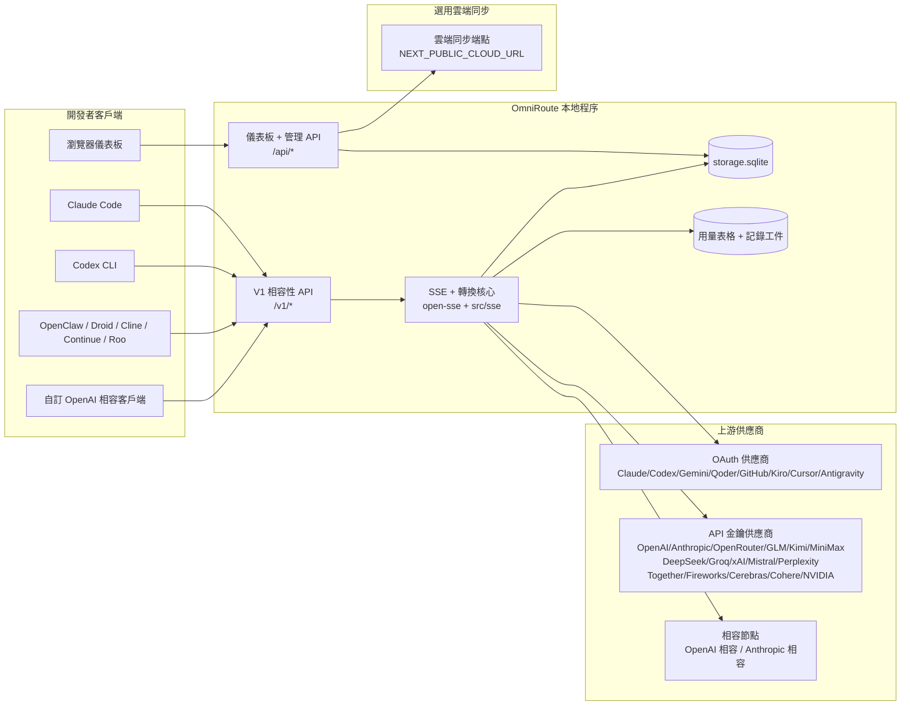
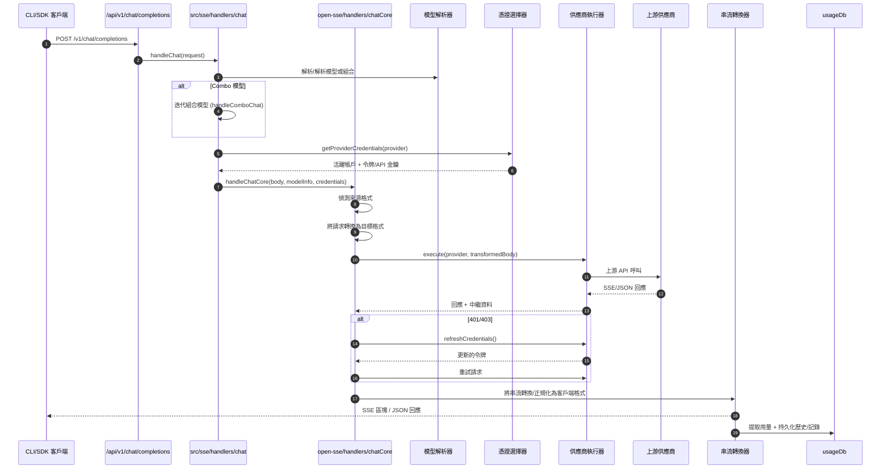
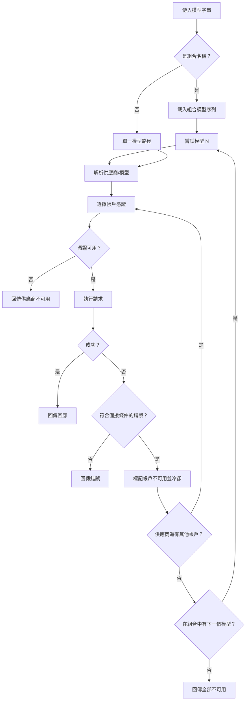
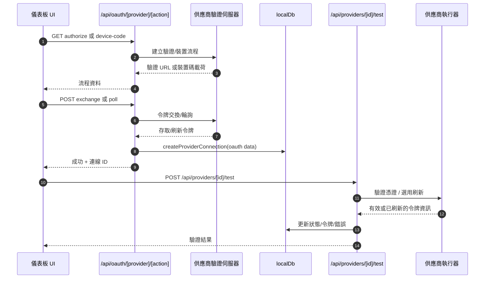
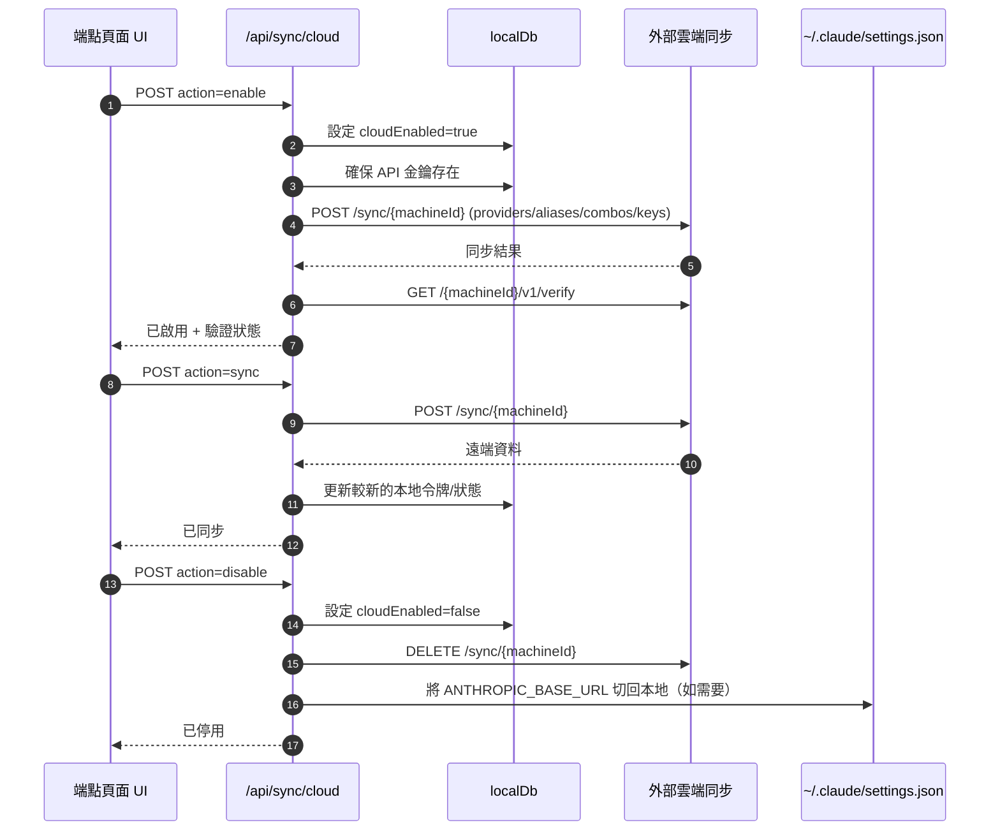
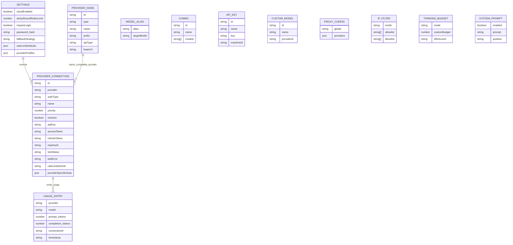
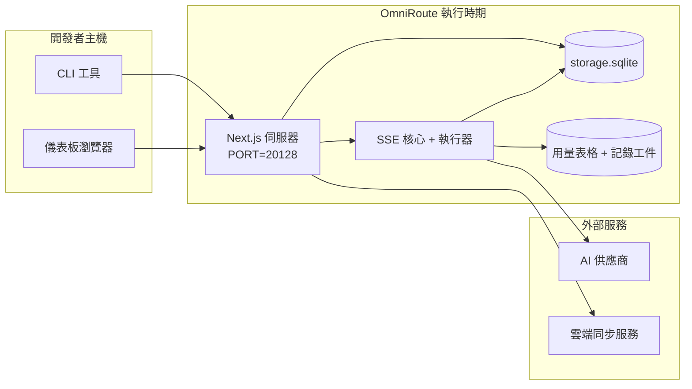

# OmniRoute 架構

🌐 **語言：** 🇺🇸 [English](./ARCHITECTURE.md) | 🇧🇷 [Português (Brasil)](../i18n/pt-BR/docs/architecture/ARCHITECTURE.md) | 🇪🇸 [Español](../i18n/es/docs/architecture/ARCHITECTURE.md) | 🇫🇷 [Français](../i18n/fr/docs/architecture/ARCHITECTURE.md) | 🇮🇹 [Italiano](../i18n/it/docs/architecture/ARCHITECTURE.md) | 🇷🇺 [Русский](../i18n/ru/docs/architecture/ARCHITECTURE.md) | 🇨🇳 [中文 (简体)](../i18n/zh-CN/docs/architecture/ARCHITECTURE.md) | 🇩🇪 [Deutsch](../i18n/de/docs/architecture/ARCHITECTURE.md) | 🇮🇳 [हिन्दी](../i18n/in/docs/architecture/ARCHITECTURE.md) | 🇹🇭 [ไทย](../i18n/th/docs/architecture/ARCHITECTURE.md) | 🇺🇦 [Українська](../i18n/uk-UA/docs/architecture/ARCHITECTURE.md) | 🇸🇦 [العربية](../i18n/ar/docs/architecture/ARCHITECTURE.md) | 🇯🇵 [日本語](../i18n/ja/docs/architecture/ARCHITECTURE.md) | 🇻🇳 [Tiếng Việt](../i18n/vi/docs/architecture/ARCHITECTURE.md) | 🇧🇬 [Български](../i18n/bg/docs/architecture/ARCHITECTURE.md) | 🇩🇰 [Dansk](../i18n/da/docs/architecture/ARCHITECTURE.md) | 🇫🇮 [Suomi](../i18n/fi/docs/architecture/ARCHITECTURE.md) | 🇮🇱 [עברית](../i18n/he/docs/architecture/ARCHITECTURE.md) | 🇭🇺 [Magyar](../i18n/hu/docs/architecture/ARCHITECTURE.md) | 🇮🇩 [Bahasa Indonesia](../i18n/id/docs/architecture/ARCHITECTURE.md) | 🇰🇷 [한국어](../i18n/ko/docs/architecture/ARCHITECTURE.md) | 🇲🇾 [Bahasa Melayu](../i18n/ms/docs/architecture/ARCHITECTURE.md) | 🇳🇱 [Nederlands](../i18n/nl/docs/architecture/ARCHITECTURE.md) | 🇳🇴 [Norsk](../i18n/no/docs/architecture/ARCHITECTURE.md) | 🇵🇹 [Português (Portugal)](../i18n/pt/docs/architecture/ARCHITECTURE.md) | 🇷🇴 [Română](../i18n/ro/docs/architecture/ARCHITECTURE.md) | 🇵🇱 [Polski](../i18n/pl/docs/architecture/ARCHITECTURE.md) | 🇸🇰 [Slovenčina](../i18n/sk/docs/architecture/ARCHITECTURE.md) | 🇸🇪 [Svenska](../i18n/sv/docs/architecture/ARCHITECTURE.md) | 🇵🇭 [Filipino](../i18n/phi/docs/architecture/ARCHITECTURE.md) | 🇨🇿 [Čeština](../i18n/cs/docs/architecture/ARCHITECTURE.md) | 🇭🇰 [中文 (繁體)](../i18n/zh-TW/docs/architecture/ARCHITECTURE.md)

_最後更新：2026-06-28_

## 執行摘要

OmniRoute 是一個建構於 Next.js 上的本地 AI 路由閘道與儀表板。
它提供單一的 OpenAI 相容端點（`/v1/*`），並透過轉換、備援、令牌刷新與用量追蹤，將流量路由至多個上游供應商。

核心能力：

- OpenAI 相容的 API 表面，適用於 CLI/工具（268 個供應商、84 個執行器）
- 跨供應商格式的請求/回應轉換
- 模型組合備援（多模型序列）
- 結構化組合步驟（`供應商 + 模型 + 連線`），支援執行期依 `compositeTiers` 排序
- 帳戶層級備援（每個供應商多帳戶）
- 主要聊天路徑中的配額預檢與配額感知 P2C 帳戶選擇
- OAuth + API 金鑰供應商連線管理（19 個 OAuth 供應商模組）
- 透過 `/v1/embeddings` 生成嵌入向量（6 個供應商、9 個模型）
- 透過 `/v1/images/generations` 生成圖片（10+ 個供應商、20+ 個模型）
- 透過 `/v1/audio/transcriptions` 進行語音轉錄（7 個供應商）
- 透過 `/v1/audio/speech` 進行文字轉語音（10 個供應商）
- 透過 `/v1/videos/generations` 生成影片（ComfyUI + SD WebUI）
- 透過 `/v1/music/generations` 生成音樂（ComfyUI）
- 透過 `/v1/search` 進行網路搜尋（5 個供應商）
- 透過 `/v1/moderations` 進行內容審核
- 透過 `/v1/rerank` 進行重新排序
- Think 標籤解析（`<think>...</think>`）用於推理模型
- 回應淨化處理，確保嚴格的 OpenAI SDK 相容性
- 角色正規化（developer→system, system→user）以實現跨供應商相容性
- 結構化輸出轉換（json_schema → Gemini responseSchema）
- 供應商、金鑰、別名、組合、設定、定價的本地持久化（26 個 DB 模組）
- 用量/成本追蹤與請求記錄
- 選用雲端同步，支援多裝置/狀態同步
- 用於 API 存取控制的 IP 允許清單/封鎖清單
- 思考預算管理（透傳/自動/自訂/自適應）
- 全域系統提示注入
- 工作階段追蹤與指紋辨識
- 每個帳戶的增強速率限制，附供應商特定設定檔
- 用於供應商韌性的斷路器模式
- 使用互斥鎖防止驚群效應
- 基於簽章的請求去重快取
- 領域層：成本規則、備援政策、鎖定政策
- 上下文轉接：帳戶輪換連續性的工作階段交接摘要
- 領域狀態持久化（SQLite 寫穿透快取，用於備援、預算、鎖定、斷路器）
- 用於集中化請求評估的政策引擎（鎖定 → 預算 → 備援）
- 請求遙測，含 p50/p95/p99 延遲彙總
- 組合目標遙測及歷史組合目標健康狀態（透過 `combo_execution_key` / `combo_step_id`）
- 關聯 ID（X-Request-Id）實現端到端追蹤
- 合規稽核記錄，可依 API 金鑰選擇退出
- 用於 LLM 品質保證的評估框架
- 健康狀態儀表板，即時顯示供應商斷路器狀態
- MCP 伺服器（87 個工具）支援 3 種傳輸方式（stdio/SSE/Streamable HTTP）
- A2A 伺服器（JSON-RPC 2.0 + SSE）含技能與任務生命週期
- 記憶系統（提取、注入、檢索、摘要）
- 技能系統（註冊表、執行器、沙箱、內建技能）
- MITM 代理，含憑證管理與 DNS 處理
- 提示注入防護中介軟體
- 提示壓縮管線，含 Caveman、RTK、堆疊管線、壓縮組合、語言套件與分析功能
- ACP（代理通訊協定）註冊表
- 模組化 OAuth 供應商（19 個獨立模組，位於 `src/lib/oauth/providers/`）
- 解除安裝/完整解除安裝指令碼
- OAuth 環境修復動作
- WebSocket 橋接，供 OpenAI 相容的 WS 客戶端使用（`/v1/ws`）
- 同步令牌管理（簽發/撤銷，ETag 版本化設定套件下載）
- GLM Thinking（`glmt`）第一級供應商預設
- 混合令牌計數（供應商端 `/messages/count_tokens` 搭配估算備援）
- 模型別名自動播種（啟動時 30+ 跨代理方言正規化）
- 安全的外送請求，含 SSRF 防護、私人 URL 封鎖與可設定的重試
- 具冷卻感知的聊天重試，含可設定的 `requestRetry` 與 `maxRetryIntervalSec`
- 啟動時使用 Zod 進行執行環境驗證
- 合規稽核 v2，含分頁、供應商 CRUD 事件與 SSRF 封鎖驗證記錄

主要執行模型：

- `src/app/api/*` 下的 Next.js 應用路由同時實作儀表板 API 與相容性 API
- `src/sse/*` + `open-sse/*` 中的共用 SSE/路由核心負責供應商執行、轉換、串流、備援與用量

## 參考圖表

v3.8.0 平台的標準版本控制 Mermaid 原始檔位於
[`docs/diagrams/`](../diagrams/README.md)。以下複製兩張作為參考；
其餘圖表請參閱各領域專屬指南。


> 原始檔：[diagrams/request-pipeline.mmd](../diagrams/request-pipeline.mmd)


> 原始檔：[diagrams/resilience-3layers.mmd](../diagrams/resilience-3layers.mmd) — 亦可參閱
> [RESILIENCE_GUIDE.md](./RESILIENCE_GUIDE.md) 與 `CLAUDE.md` 韌性參考。

## 範圍與邊界

### 涵蓋範圍

- 本地閘道執行環境
- 儀表板管理 API
- 供應商驗證與令牌刷新
- 請求轉換與 SSE 串流
- 本地狀態 + 用量持久化
- 選用雲端同步協調

### 不涵蓋範圍

- `NEXT_PUBLIC_CLOUD_URL` 背後的雲端服務實作
- 本地程序外的供應商 SLA/控制平面
- 外部 CLI 二進位檔案本身（Claude CLI、Codex CLI 等）

## 儀表板表面（目前版本）

`src/app/(dashboard)/dashboard/` 下的主要頁面：

- `/dashboard` — 快速入門 + 供應商概覽
- `/dashboard/endpoint` — 端點代理 + MCP + A2A + API 端點分頁
- `/dashboard/providers` — 供應商連線與憑證
- `/dashboard/combos` — 組合策略、範本、逐步建置器、模型路由規則、手動持久化排序
- `/dashboard/auto-combo` — 自動組合引擎：評分權重、模式套件、虛擬工廠預設、遙測
- `/dashboard/costs` — 成本彙總與定價檢視
- `/dashboard/analytics` — 用量分析、評估、組合目標健康狀態
- `/dashboard/limits` — 配額/速率控制
- `/dashboard/cli-tools` — CLI 入門、執行環境偵測、設定產生
- `/dashboard/agents` — 偵測到的 ACP 代理 + 自訂代理註冊
- `/dashboard/cloud-agents` — 雲端託管代理任務（Codex Cloud、Devin、Jules）與任務生命週期
- `/dashboard/skills` — A2A 技能註冊表、沙箱執行、內建技能目錄
- `/dashboard/memory` — 持久對話記憶體檢視與檢索
- `/dashboard/webhooks` — 外送 Webhook 訂閱、金鑰輪換、重試統計
- `/dashboard/batch` — 批次任務提交與進度
- `/dashboard/cache` — 讀取快取與推理快取統計、清除控制
- `/dashboard/playground` — 針對任何已設定組合/模型的互動式聊天測試區
- `/dashboard/changelog` — 應用內更新日誌檢視器（渲染 `CHANGELOG.md`）
- `/dashboard/system` — 執行時期診斷、版本資訊、環境驗證表面
- `/dashboard/onboarding` — 新安裝的首次執行設定精靈
- `/dashboard/media` — 圖片/影片/音樂測試區
- `/dashboard/search-tools` — 搜尋供應商測試與歷史記錄
- `/dashboard/health` — 運行時間、斷路器、速率限制、配額監控工作階段
- `/dashboard/logs` — 請求/代理/稽核/主控台記錄
- `/dashboard/settings` — 系統設定分頁（一般、路由、組合預設等）
- `/dashboard/context/caveman` — Caveman 壓縮規則、語言套件、預覽與輸出模式
- `/dashboard/context/rtk` — RTK 命令輸出過濾器、預覽與執行時期安全設定
- `/dashboard/context/combos` — 指派給路由組合的命名壓縮管線
- `/dashboard/translator` — 轉換器檢視與請求格式轉換預覽
- `/dashboard/audit` — 合規稽核記錄瀏覽器，含分頁與結構化中繼資料
- `/dashboard/usage` — 與 `usage_history` 關聯的每次請求用量瀏覽器
- `/dashboard/compression` — 壓縮分析、統計資料與管線指派
- `/dashboard/api-manager` — API 金鑰生命週期與模型權限

## 高層級系統上下文



## 核心執行時期元件

## 1) API 與路由層（Next.js 應用路由）

主要目錄：

- `src/app/api/v1/*` 與 `src/app/api/v1beta/*` 用於相容性 API
- `src/app/api/*` 用於管理/設定 API
- `next.config.mjs` 中的 Next 重寫規則將 `/v1/*` 對應到 `/api/v1/*`

重要的相容性路由：

- `src/app/api/v1/chat/completions/route.ts`
- `src/app/api/v1/messages/route.ts`
- `src/app/api/v1/responses/route.ts`
- `src/app/api/v1/models/route.ts` — 包含 `custom: true` 的自訂模型
- `src/app/api/v1/embeddings/route.ts` — 嵌入向量生成（6 個供應商）
- `src/app/api/v1/images/generations/route.ts` — 圖片生成（4+ 個供應商，含 Antigravity/Nebius）
- `src/app/api/v1/messages/count_tokens/route.ts`
- `src/app/api/v1/providers/[provider]/chat/completions/route.ts` — 專屬的每個供應商聊天
- `src/app/api/v1/providers/[provider]/embeddings/route.ts` — 專屬的每個供應商嵌入
- `src/app/api/v1/providers/[provider]/images/generations/route.ts` — 專屬的每個供應商圖片
- `src/app/api/v1beta/models/route.ts`
- `src/app/api/v1beta/models/[...path]/route.ts`

管理領域：

- 驗證/設定：`src/app/api/auth/*`、`src/app/api/settings/*`
- 供應商/連線：`src/app/api/providers*`
- 供應商節點：`src/app/api/provider-nodes*`
- 自訂模型：`src/app/api/provider-models`（GET/POST/DELETE）
- 模型目錄：`src/app/api/models/route.ts`（GET）
- 代理設定：`src/app/api/settings/proxy`（GET/PUT/DELETE）+ `src/app/api/settings/proxy/test`（POST）
- OAuth：`src/app/api/oauth/*`
- 金鑰/別名/組合/定價：`src/app/api/keys*`、`src/app/api/models/alias`、`src/app/api/combos*`、`src/app/api/pricing`
- 用量：`src/app/api/usage/*`
- 同步/雲端：`src/app/api/sync/*`、`src/app/api/cloud/*`
- CLI 工具輔助：`src/app/api/cli-tools/*`
- IP 過濾器：`src/app/api/settings/ip-filter`（GET/PUT）
- 思考預算：`src/app/api/settings/thinking-budget`（GET/PUT）
- 系統提示：`src/app/api/settings/system-prompt`（GET/PUT）
- 壓縮：`src/app/api/settings/compression`、`src/app/api/compression/*` 與 `src/app/api/context/*`
- 工作階段：`src/app/api/sessions`（GET）
- 速率限制：`src/app/api/rate-limits`（GET）
- 韌性：`src/app/api/resilience`（GET/PATCH）— 請求佇列、連線冷卻、供應商斷路器、等待冷卻設定
- 韌性重置：`src/app/api/resilience/reset`（POST）— 重置供應商斷路器
- 快取統計：`src/app/api/cache/stats`（GET/DELETE）
- 遙測：`src/app/api/telemetry/summary`（GET）
- 預算：`src/app/api/usage/budget`（GET/POST）
- 備援鏈：`src/app/api/fallback/chains`（GET/POST/DELETE）
- 合規稽核：`src/app/api/compliance/audit-log`（GET，含分頁 + 結構化中繼資料）
- 評估：`src/app/api/evals`（GET/POST）、`src/app/api/evals/[suiteId]`（GET）
- 政策：`src/app/api/policies`（GET/POST）
- 同步令牌：`src/app/api/sync/tokens`（GET/POST）、`src/app/api/sync/tokens/[id]`（GET/DELETE）
- 設定套件：`src/app/api/sync/bundle`（GET，設定/供應商/組合/金鑰的 ETag 版本化快照）
- WebSocket：`src/app/api/v1/ws/route.ts` — OpenAI 相容 WS 客戶端的升級處理器

## 2) SSE + 轉換核心

主要流程模組：

- 入口：`src/sse/handlers/chat.ts`
- 核心協調：`open-sse/handlers/chatCore.ts`
- 供應商執行轉接器：`open-sse/executors/*`
- 格式偵測/供應商設定：`open-sse/services/provider.ts`
- 模型解析/解析：`src/sse/services/model.ts`、`open-sse/services/model.ts`
- 帳戶備援邏輯：`open-sse/services/accountFallback.ts`
- 轉換註冊表：`open-sse/translator/index.ts`
- 串流轉換：`open-sse/utils/stream.ts`、`open-sse/utils/streamHandler.ts`
- 用量提取/正規化：`open-sse/utils/usageTracking.ts`
- Think 標籤解析器：`open-sse/utils/thinkTagParser.ts`
- 嵌入處理器：`open-sse/handlers/embeddings.ts`
- 嵌入供應商註冊表：`open-sse/config/embeddingRegistry.ts`
- 圖片生成處理器：`open-sse/handlers/imageGeneration.ts`
- 圖片供應商註冊表：`open-sse/config/imageRegistry.ts`
- 回應淨化：`open-sse/handlers/responseSanitizer.ts`
- 角色正規化：`open-sse/services/roleNormalizer.ts`

服務（商業邏輯）：

- 帳戶選擇/評分：`open-sse/services/accountSelector.ts`
- 上下文生命週期管理：`open-sse/services/contextManager.ts`
- IP 過濾器執行：`open-sse/services/ipFilter.ts`
- 工作階段追蹤：`open-sse/services/sessionManager.ts`
- 請求去重：`open-sse/services/signatureCache.ts`
- 系統提示注入：`open-sse/services/systemPrompt.ts`
- 思考預算管理：`open-sse/services/thinkingBudget.ts`
- 萬用字元模型路由：`open-sse/services/wildcardRouter.ts`
- 速率限制管理：`open-sse/services/rateLimitManager.ts`
- 斷路器：`src/shared/utils/circuitBreaker.ts`
- 上下文交接：`open-sse/services/contextHandoff.ts` — 用於上下文轉接策略的交接摘要產生與注入
- 壓縮：`open-sse/services/compression/*` — 供應商轉換前的主動壓縮；包含 Caveman 規則、RTK 過濾器、堆疊管線、壓縮組合、統計資料與驗證
- Codex 配額擷取器：`open-sse/services/codexQuotaFetcher.ts` — 擷取 Codex 配額用於上下文轉接交接決策
- 具冷卻感知的重試：`src/sse/services/cooldownAwareRetry.ts` — 每個模型的冷卻重試，具可設定的 `requestRetry` / `maxRetryIntervalSec`
- 安全外送請求：`src/shared/network/safeOutboundFetch.ts` — 受防護的供應商/模型請求，含 SSRF 防護、私人 URL 封鎖、重試與逾時
- 外送 URL 防護：`src/shared/network/outboundUrlGuard.ts` — 驗證供應商 URL 是否位於私人/本地 CIDR 範圍
- 供應商請求預設值：`open-sse/services/providerRequestDefaults.ts` — 供應商層級的 `maxTokens`、`temperature`、`thinkingBudgetTokens` 預設值
- GLM 供應商常數：`open-sse/config/glmProvider.ts` — 共用的 GLM 模型、配額 URL、GLMT 逾時/預設值
- Antigravity 上游：`open-sse/config/antigravityUpstream.ts` — 基礎 URL 與探索路徑常數
- Codex 客戶端常數：`open-sse/config/codexClient.ts` — 版本化的使用者代理與客戶端版本值
- 模型別名播種：`src/lib/modelAliasSeed.ts` — 啟動時播種 30+ 跨代理方言別名

領域層模組：

- 成本規則/預算：`src/domain/costRules.ts`
- 備援政策：`src/domain/fallbackPolicy.ts`
- 組合解析器：`src/domain/comboResolver.ts`
- 鎖定政策：`src/domain/lockoutPolicy.ts`
- 政策引擎：`src/domain/policyEngine.ts` — 集中化的鎖定 → 預算 → 備援評估
- 錯誤碼目錄：`src/shared/constants/errorCodes.ts`
- 請求 ID：`src/shared/utils/requestId.ts`
- 擷取逾時：`src/shared/utils/fetchTimeout.ts`
- 請求遙測：`src/shared/utils/requestTelemetry.ts`
- 合規/稽核：`src/lib/compliance/index.ts`
- 評估執行器：`src/lib/evals/evalRunner.ts`
- 領域狀態持久化：`src/lib/db/domainState.ts` — 備援鏈、預算、成本歷史、鎖定狀態、斷路器的 SQLite CRUD

OAuth 供應商模組（`src/lib/oauth/providers/` 下的 16 個個別檔案）：

- 註冊表索引：`src/lib/oauth/providers/index.ts`
- 個別供應商：`claude.ts`、`codex.ts`、`gemini.ts`、`antigravity.ts`、`agy.ts`、`qoder.ts`、`qwen.ts`、`kimi-coding.ts`、`github.ts`、`kiro.ts`、`cursor.ts`、`kilocode.ts`、`cline.ts`、`windsurf.ts`、`gitlab-duo.ts`、`trae.ts`
- 薄包裝層：`src/lib/oauth/providers.ts` — 從個別模組重新匯出

## 5) 嵌入式服務（v3.8.4）

OmniRoute 可以安裝、監督並路由至本地運行的 AI 工具程序，
稱為**嵌入式服務**。v3.8.4 中提供了兩項：9Router 和 CLIProxyAPI。

架構層：

- **UI**（`/dashboard/providers/services`）— 雙分頁頁面，含生命週期控制、
  即時記錄串流、API 金鑰管理，以及（針對 9Router）透過內部反向代理提供的嵌入式原生 UI。
- **API**（`/api/services/{name}/*`）— 9Router 有 8 個端點，CLIProxyAPI 有 7 個端點，
  全部標記為 **LOCAL_ONLY**（硬性規則 #17）。共用的 `GET /api/services/[name]/logs`
  SSE 端點同時服務兩項服務。
- **監督器**（`src/lib/services/`）— 泛用的 `ServiceSupervisor` 類別包裝
  `child_process.spawn`，持有 5 MB 環形緩衝區用於 SSE 記錄串流、健康狀態
  探測迴圈、原子操作鎖與 SIGTERM→SIGKILL 優雅關機。
  `bootstrap.ts` 在程序啟動時連接所有已設定的服務。
- **供應商/執行器**（`open-sse/executors/ninerouter.ts`）— 9Router 以真實供應商型態
  暴露。模型前綴為 `9router/{sub}/{model}`，每 5 分鐘從 9Router 的 `/v1/models` 端點同步一次。

深入探討：`docs/frameworks/EMBEDDED-SERVICES.md`

## 主要子系統（v3.8.0）

### A. 自動組合引擎

自動組合在請求時動態評分並選取路由目標，而非依賴靜態組合定義。它驅動 `auto/*` 模型前綴系列。

- 引擎入口：`open-sse/services/autoCombo/`（`autoComboEngine.ts`、`scoringEngine.ts`、`virtualFactory.ts`、`modePacks.ts`）
- 解析器：`src/domain/comboResolver.ts`（`auto/` 前綴的自動偵測）
- 儀表板：`/dashboard/auto-combo`
- 遙測：`auto_combo_decisions` SQLite 表格

關鍵能力：

- **17 種路由策略**（優先級、加權、先填滿、輪詢、P2C、隨機、
  最少使用、成本最佳化、重置感知、重置視窗、餘裕空間、嚴格隨機、
  **自動**、lkpg、上下文最佳化、上下文轉接、**融合**，加上備援路徑）—
  auto 是 v3.8.0 的主要新增功能；`fusion`（面板扇出 + 判斷綜合，
  `open-sse/services/fusion.ts`）是 v3.8.36 的新功能。
- **9 因子評分**：成本、p95 延遲、成功率、配額餘裕、鎖定
  接近度、斷路器狀態、近期失敗、模型可用性與標籤親和性。
- **虛擬工廠**在沒有相符的命名組合時實例化暫時組合，
  從健康活躍的供應商連線中篩選候選者。
- **自動前綴**：`auto/coding`、`auto/cheap`、`auto/fast`、`auto/offline`、
  `auto/smart`、`auto/lkgp` — 每個都有調整過的權重設定檔。
- **4 種模式套件**：coding、fast、cheap、smart — 以預設權重
  設定出貨，可從儀表板呼叫。

完整的演算法細節（因子公式、權重調整）請參閱
[`docs/routing/AUTO-COMBO.md`](../routing/AUTO-COMBO.md)。

### B. 雲端代理

雲端代理將第三方託管的程式碼代理平台（Codex Cloud、Devin、
Jules）包裝在統一的 DB 支援任務生命週期後方。所有任務建立/檢視
端點都需要管理驗證。

- 模組根目錄：`src/lib/cloudAgent/`（`baseAgent.ts`、`registry.ts`、`api.ts`、
  `types.ts`、`db.ts`，加上 `agents/` 下的每個代理子目錄）
- 每個代理的實作：`agents/codex/`、`agents/devin/`、`agents/jules/`
- 公開端點：`/api/v1/agents/tasks/*`（列表/建立/取得/取消）
- 管理端點：`/api/cloud/*`（佈建、狀態、批次）
- 儀表板：`/dashboard/cloud-agents`
- 儲存：`cloud_agent_tasks` 表格

每個代理的佈建與 OAuth 細節，請參閱
[`docs/frameworks/CLOUD_AGENT.md`](../frameworks/CLOUD_AGENT.md)。

### C. 護欄

護欄模組是一個可熱重載的中介軟體層，檢查請求
與回應中的 PII、提示注入與不安全的視覺內容。違規
會以 HTTP **503** 加上結構化錯誤碼短路請求，讓
下游呼叫者可以重試或分支。

- 模組根目錄：`src/lib/guardrails/`（`base.ts`、`registry.ts`、`piiMasker.ts`、
  `promptInjection.ts`、`visionBridge.ts`、`visionBridgeHelpers.ts`）
- 熱重載：註冊表監聽設定變更並原地重建鏈
- 接入點：聊天處理器入口、圖片生成處理器、回應淨化器
- HTTP 合約：違規以 `503` 狀態碼搭配 `error.code = "GUARDRAIL_VIOLATION"` 呈現

規則集撰寫與閾值調整，請參閱
[`docs/security/GUARDRAILS.md`](../security/GUARDRAILS.md)。

### D. 領域層

`src/domain/` 命名空間集中化政策決策，讓路由處理器無需
自行組合鎖定/預算/備援邏輯。

- 政策引擎：`src/domain/policyEngine.ts` — 執行前評估的單一入口點（鎖定 → 預算 → 備援順序）
- 成本規則：`src/domain/costRules.ts`
- 備援政策：`src/domain/fallbackPolicy.ts`
- 鎖定政策：`src/domain/lockoutPolicy.ts`
- 基於標籤的路由：`src/domain/tagRouter.ts`
- 組合解析器：`src/domain/comboResolver.ts` — 將組合名稱、`auto/*` 前綴與萬用字元模型目標解析為具體執行計畫
- 連線/模型規則連接器：`src/domain/connectionModelRules.ts`
- 模型可用性快照：`src/domain/modelAvailability.ts`
- 供應商到期追蹤：`src/domain/providerExpiration.ts`
- 配額快取：`src/domain/quotaCache.ts`
- 降級狀態：`src/domain/degradation.ts`
- 設定稽核：`src/domain/configAudit.ts`
- OmniRoute 回應中繼資料建置器：`src/domain/omnirouteResponseMeta.ts`
- 評估子系統：`src/domain/assessment/` — 定期評估任務

### E. 授權管線

授權管線對每個傳入請求進行分類，並在調度前套用適當的政策鏈。

- 管線入口：`src/server/authz/pipeline.ts`
- 請求分類器：`src/server/authz/classify.ts` — 區分公開相容性路由與管理路由
- 公開路由清單：`src/shared/constants/publicApiRoutes.ts`
- 政策：`src/server/authz/policies/` — 可組合的斷言（`requireApiKey`、`requireManagement`、`requireFreshAuth` 等）
- 標頭工具：`src/server/authz/headers.ts`
- 斷言輔助：`src/server/authz/assertAuth.ts`
- 請求上下文：`src/server/authz/context.ts`

公開路由與管理路由之間有嚴格邊界：代理/冷卻 API 與供應商變更需要管理驗證（缺少時回傳 HTTP 401）。

完整的路由分類規則，請參閱
[`docs/architecture/AUTHZ_GUIDE.md`](./AUTHZ_GUIDE.md)。

### F. 工作流程 FSM 與任務感知路由器

一個有限狀態機驅動的路由器，疊加在組合選擇之上，根據偵測到的工作流程階段（規劃、執行、審查）與背景任務親和性來引導流量。

- 工作流程 FSM：`open-sse/services/workflowFSM.ts`
- 任務感知路由器：`open-sse/services/taskAwareRouter.ts`
- 背景任務偵測器：`open-sse/services/backgroundTaskDetector.ts`
- 意圖分類器：`open-sse/services/intentClassifier.ts`

FSM 轉換結果饋入自動組合的評分，對背景/自動化任務偏向較便宜的模型，對互動式規劃/審查輪次偏向較強的模型。

### G. 供應商專屬韌性

數個供應商配備了專用的韌性與隱匿模組，建構在全域斷路器 / 連線冷卻 / 模型鎖定層之上：

- Antigravity 429 引擎：`open-sse/services/antigravity429Engine.ts`（輪換身分、清除回應標頭、透過 `antigravityCredits.ts`、`antigravityHeaderScrub.ts`、`antigravityHeaders.ts`、`antigravityIdentity.ts`、`antigravityObfuscation.ts`、`antigravityVersion.ts` 驅動點數/版本追蹤）
- ModelScope 配額政策：`open-sse/services/modelscopePolicy.ts`
- Claude Code CCH（相容性通道握手）：`open-sse/services/claudeCodeCCH.ts`，加上 `claudeCodeCompatible.ts`、`claudeCodeConstraints.ts`、`claudeCodeExtraRemap.ts`、`claudeCodeToolRemapper.ts`
- Claude Code 指紋塑造：`open-sse/services/claudeCodeFingerprint.ts`
- Claude Code 混淆：`open-sse/services/claudeCodeObfuscation.ts`
- ChatGPT TLS 客戶端：`open-sse/services/chatgptTlsClient.ts`（curl-impersonate 風格的 ChatGPT-Web 工作階段）
- ChatGPT 圖片快取：`open-sse/services/chatgptImageCache.ts`

完整的隱匿手冊與操作指南，請參閱
[`docs/security/STEALTH_GUIDE.md`](../security/STEALTH_GUIDE.md)。

### H. Webhook、推理快取、讀取快取

- **Webhook** — 用於供應商/帳戶/任務事件的外送調度。
  - 調度器：`src/lib/webhookDispatcher.ts`
  - 儲存：`webhooks` SQLite 表格（透過 `src/lib/db/webhooks.ts`）
  - 儀表板：`/dashboard/webhooks`（訂閱、秘密、重試歷史）
  - 事件分類與重試語意，請參閱 [`docs/frameworks/WEBHOOKS.md`](../frameworks/WEBHOOKS.md)。
- **推理快取** — 為會發出思考令牌的供應商（Claude、GLMT 等）提供可重播的推理區塊，讓連續輪次可以跳過重新思考。
  - DB 層：`src/lib/db/reasoningCache.ts`
  - 服務層：`open-sse/services/reasoningCache.ts`
  - 重播語意，請參閱 [`docs/routing/REASONING_REPLAY.md`](../routing/REASONING_REPLAY.md)。
- **讀取快取** — 以簽章為鍵的短生命週期回應快取，用於收斂來自損壞上游 SDK 的相同重試。
  - DB 層：`src/lib/db/readCache.ts`
  - 統計端點：`GET /api/cache/stats`，儀表板位於 `/dashboard/cache`

## 3) 持久化層

主要狀態 DB（SQLite）：

- 核心基礎設施：`src/lib/db/core.ts`（better-sqlite3、遷移、WAL）
- 重新匯出外觀：`src/lib/localDb.ts`（供呼叫者使用的薄相容層）
- 檔案：`${DATA_DIR}/storage.sqlite`（或設定了 `$XDG_CONFIG_HOME/omniroute/storage.sqlite` 時使用該路徑，否則為 `~/.omniroute/storage.sqlite`）
- 實體（表格 + KV 命名空間）：providerConnections、providerNodes、modelAliases、combos、apiKeys、settings、pricing、**customModels**、**proxyConfig**、**ipFilter**、**thinkingBudget**、**systemPrompt**

用量持久化：

- 外觀：`src/lib/usageDb.ts`（`src/lib/usage/*` 中的分解模組）
- `storage.sqlite` 中的 SQLite 表格：`usage_history`、`call_logs`、`proxy_logs`
- 為相容性/除錯目的保留的選用檔案工件（`${DATA_DIR}/log.txt`、`${DATA_DIR}/call_logs/`、`<repo>/logs/...`）
- 舊版 JSON 檔案在啟動遷移時會移轉至 SQLite（若存在）

領域狀態 DB（SQLite）：

- `src/lib/db/domainState.ts` — 領域狀態的 CRUD 操作
- 表格（在 `src/lib/db/core.ts` 中建立）：`domain_fallback_chains`、`domain_budgets`、`domain_cost_history`、`domain_lockout_state`、`domain_circuit_breakers`
- 寫穿透快取模式：記憶體中的 Maps 在執行時期具有權威性；變更同步寫入 SQLite；冷啟動時從 DB 恢復狀態

## 4) 驗證 + 安全表面

- 儀表板 Cookie 驗證：`src/proxy.ts`、`src/app/api/auth/login/route.ts`
- API 金鑰生成/驗證：`src/shared/utils/apiKey.ts`
- 供應商秘密儲存在 `providerConnections` 項目中
- 透過 `open-sse/utils/proxyFetch.ts`（環境變數）與 `open-sse/utils/networkProxy.ts`（可針對每個供應商或全域設定）支援外送代理
- SSRF / 外送 URL 防護：`src/shared/network/outboundUrlGuard.ts` — 封鎖所有供應商呼叫的私人/迴路/鏈結本地範圍
- 執行時期環境驗證：`src/lib/env/runtimeEnv.ts` — 所有環境變數的 Zod 架構，以啟動錯誤/警告形式呈現
- 同步令牌：`src/lib/db/syncTokens.ts` — 用於設定套件下載端點的範圍限定令牌；由 `sync_tokens` SQLite 表格支援（遷移 `024_create_sync_tokens.sql`）
- WebSocket 握手驗證：`src/lib/ws/handshake.ts` — 透過 API 金鑰或工作階段 Cookie 驗證 WS 升級請求

## 5) 雲端同步

- 排程器初始化：`src/lib/initCloudSync.ts`、`src/shared/services/initializeCloudSync.ts`、`src/shared/services/modelSyncScheduler.ts`
- 定期任務：`src/shared/services/cloudSyncScheduler.ts`
- 定期任務：`src/shared/services/modelSyncScheduler.ts`
- 控制路由：`src/app/api/sync/cloud/route.ts`

## 請求生命週期（`/v1/chat/completions`）



## 組合 + 帳戶備援流程



備援決策由 `open-sse/services/accountFallback.ts` 根據狀態碼與錯誤訊息啟發式驅動。組合路由增加了一層額外防護：供應商範圍的 400 錯誤（如上游內容封鎖與角色驗證失敗）被視為模型本地錯誤，以便後續組合目標仍可執行。

## OAuth 入門與令牌刷新生命週期



即時流量中的刷新在 `open-sse/handlers/chatCore.ts` 內透過執行器 `refreshCredentials()` 執行。

## 雲端同步生命週期（啟用 / 同步 / 停用）



定期同步由 `CloudSyncScheduler` 在雲端啟用時觸發。

## 資料模型與儲存對映



實體儲存檔案：

- 主要執行時期 DB：`${DATA_DIR}/storage.sqlite`
- 請求記錄行：`${DATA_DIR}/log.txt`（相容/除錯工件）
- 結構化呼叫負載歸檔：`${DATA_DIR}/call_logs/`
- 選用轉換器/請求除錯工作階段：`<repo>/logs/...`

## 部署拓撲



## 模組對映（決策關鍵）

### 路由與 API 模組

- `src/app/api/v1/*`、`src/app/api/v1beta/*`：相容性 API
- `src/app/api/v1/providers/[provider]/*`：專屬的每個供應商路由（聊天、嵌入、圖片）
- `src/app/api/providers*`：供應商 CRUD、驗證、測試
- `src/app/api/provider-nodes*`：自訂相容節點管理
- `src/app/api/provider-models`：自訂模型管理（CRUD）
- `src/app/api/models/route.ts`：模型目錄 API（別名 + 自訂模型）
- `src/app/api/oauth/*`：OAuth/裝置碼流程
- `src/app/api/keys*`：本地 API 金鑰生命週期
- `src/app/api/models/alias`：別名管理
- `src/app/api/combos*`：備援組合管理
- `src/app/api/pricing`：用於成本計算的定價覆蓋
- `src/app/api/settings/proxy`：代理設定（GET/PUT/DELETE）
- `src/app/api/settings/proxy/test`：外送代理連線測試（POST）
- `src/app/api/usage/*`：用量與記錄 API
- `src/app/api/sync/*` + `src/app/api/cloud/*`：雲端同步與雲端面向輔助
- `src/app/api/cli-tools/*`：本地 CLI 設定寫入器/檢查器
- `src/app/api/settings/ip-filter`：IP 允許清單/封鎖清單（GET/PUT）
- `src/app/api/settings/thinking-budget`：思考令牌預算設定（GET/PUT）
- `src/app/api/settings/system-prompt`：全域系統提示（GET/PUT）
- `src/app/api/settings/compression`：全域壓縮設定（GET/PUT）
- `src/app/api/compression/*`：壓縮預覽、規則中繼資料與語言套件
- `src/app/api/context/caveman/config`：Caveman 設定別名（GET/PUT）
- `src/app/api/context/rtk/*`：RTK 設定、過濾器目錄、測試端點與原始輸出恢復
- `src/app/api/context/combos*`：壓縮組合 CRUD 與路由組合指派
- `src/app/api/context/analytics`：壓縮分析別名
- `src/app/api/sessions`：活躍工作階段列表（GET）
- `src/app/api/rate-limits`：每個帳戶的速率限制狀態（GET）
- `src/app/api/sync/tokens`：同步令牌 CRUD（GET/POST）
- `src/app/api/sync/tokens/[id]`：同步令牌取得/刪除（GET/DELETE）
- `src/app/api/sync/bundle`：設定套件下載（GET，ETag 版本化）
- `src/app/api/v1/ws`：OpenAI 相容 WS 客戶端的 WebSocket 升級處理器

### 路由與執行核心

- `src/sse/handlers/chat.ts`：請求解析、組合處理、帳戶選擇迴圈
- `open-sse/handlers/chatCore.ts`：轉換、執行器調度、重試/刷新處理、串流設定
- `open-sse/executors/*`：供應商特定的網路與格式行為

### 轉換註冊表與格式轉換器

- `open-sse/translator/index.ts`：轉換器註冊表與協調
- 請求轉換器：`open-sse/translator/request/*`（9 個模組 — `antigravity-to-openai`、`claude-to-gemini`、`claude-to-openai`、`gemini-to-openai`、`openai-responses`、`openai-to-claude`、`openai-to-cursor`、`openai-to-gemini`、`openai-to-kiro`）
- 回應轉換器：`open-sse/translator/response/*`（8 個模組 — `claude-to-openai`、`cursor-to-openai`、`gemini-to-claude`、`gemini-to-openai`、`kiro-to-openai`、`openai-responses`、`openai-to-antigravity`、`openai-to-claude`）
- 輔助工具：`open-sse/translator/helpers/*`（8 個模組 — `claudeHelper`、`geminiHelper`、`geminiToolsSanitizer`、`maxTokensHelper`、`openaiHelper`、`responsesApiHelper`、`schemaCoercion`、`toolCallHelper`）
- 格式常數：`open-sse/translator/formats.ts`
- 啟動與註冊表：`open-sse/translator/bootstrap.ts`、`open-sse/translator/registry.ts`
- 圖片格式輔助：`open-sse/translator/image/`

### 持久化

- `src/lib/db/*`：SQLite 上的持久設定/狀態與領域持久化
- `src/lib/localDb.ts`：DB 模組的相容性重新匯出
- `src/lib/usageDb.ts`：基於 SQLite 表格的用量歷史/呼叫記錄外觀

## 供應商執行器覆蓋範圍（策略模式）

每個供應商都有一個專門的執行器，繼承自 `BaseExecutor`（位於 `open-sse/executors/base.ts`），提供 URL 建置、標頭建構、指數退避重試、憑證刷新鉤子與 `execute()` 協調方法。

| 執行器 | 供應商 | 特殊處理 |
| ------------------------ | ----------------------------------------------------------------------------------------------------------------------------------------------------------- | -------------------------------------------------------------------- |
| `DefaultExecutor` | OpenAI、Claude、Gemini、Qwen、OpenRouter、GLM、Kimi、MiniMax、DeepSeek、Groq、xAI、Mistral、Perplexity、Together、Fireworks、Cerebras、Cohere、NVIDIA 等 | 每個供應商的動態 URL/標頭設定 |
| `AntigravityExecutor` | Google Antigravity | 自訂專案/工作階段 ID、Retry-After 解析、429 混淆 |
| `AzureOpenAIExecutor` | Azure OpenAI | 基於部署的路由、api-version 查詢強制 |
| `BlackboxWebExecutor` | Blackbox AI（網頁模式） | 含 TLS 指紋模擬的網頁工作階段反向 |
| `ChatGPTWebExecutor` | ChatGPT 網頁 | TLS 客戶端 + 工作階段 Cookie 管理（`chatgptTlsClient.ts`） |
| `ClaudeIdentityExecutor` | Claude.ai（CCH 路徑） | 約束 + 工具重新對應管線、指紋塑造 |
| `CliProxyApiExecutor` | CLIProxyAPI 相容供應商 | 自訂驗證與協定處理 |
| `CloudflareAiExecutor` | Cloudflare Workers AI | 帳戶 ID 注入、基於 Neurons 的用量追蹤 |
| `CodexExecutor` | OpenAI Codex | 注入系統指令、強制推理努力 |
| `CommandCodeExecutor` | Command Code | OAuth + 每個工作階段的標頭輪換 |
| `CursorExecutor` | Cursor IDE | ConnectRPC 協定、Protobuf 編碼、透過 checksum 的請求簽署 |
| `DevinCliExecutor` | Devin CLI | 透過雲端代理模組的 Devin 任務生命週期橋接 |
| `GithubExecutor` | GitHub Copilot | Copilot 令牌刷新、模擬 VSCode 標頭 |
| `GitlabExecutor` | GitLab Duo | GitLab OAuth + 專案範圍路由 |
| `GlmExecutor` | Z.AI GLM（含 `glmt` 預設） | 思考預算感知、GLMT 預設常數 |
| `GrokWebExecutor` | xAI Grok 網頁 | 網頁工作階段反向、模式選擇（think/standard） |
| `KieExecutor` | KIE | 自訂令牌簽發，含輪換的工作階段錨點 |
| `KiroExecutor` | AWS CodeWhisperer/Kiro | AWS EventStream 二進位格式 → SSE 轉換 |
| `MuseSparkWebExecutor` | Muse Spark（網頁） | 含圖片訊息橋接的網頁工作階段反向 |
| `NlpCloudExecutor` | NLP Cloud | 供應商特定的請求主體形式 |
| `OpenCodeExecutor` | OpenCode | AI SDK 相容供應商設定 |
| `PerplexityWebExecutor` | Perplexity 網頁 | 用於聊天延續的網頁工作階段反向 |
| `PetalsExecutor` | Petals 分散式推理 | 去中心化群組路由 |
| `PollinationsExecutor` | Pollinations AI | 無需 API 金鑰、速率限制請求 |
| `PuterExecutor` | Puter | 基於瀏覽器的供應商整合 |
| `QoderExecutor` | Qoder AI | PAT 與 OAuth 支援、多模型免費方案 |
| `VertexExecutor` | Google Vertex AI | 服務帳戶驗證、基於區域的端點 |
| `WindsurfExecutor` | Windsurf（Codeium） | Codeium OAuth + 工作階段令牌刷新 |

所有其他供應商（包括自訂相容節點）使用 `DefaultExecutor`。

## 供應商相容性矩陣

> **注意：** 以下矩陣為 OmniRoute v3.8.0 中 237 個已註冊供應商的代表性樣本。
> 完整且持續更新的清單，請參閱
> [`docs/reference/PROVIDER_REFERENCE.md`](../reference/PROVIDER_REFERENCE.md)（自動產生）或
> `src/shared/constants/providers.ts`（載入時經 Zod 驗證）中的權威來源。

| 供應商 | 格式 | 驗證 | 串流 | 非串流 | 令牌刷新 | 用量 API |
| ----------------- | ---------------- | --------------------- | ---------------- | ---------- | ------------- | ------------------ |
| Claude | claude | API 金鑰 / OAuth | ✅ | ✅ | ✅ | ⚠️ 僅管理員 |
| Gemini | gemini | API 金鑰 / OAuth | ✅ | ✅ | ✅ | ⚠️ Cloud Console |
| Antigravity | antigravity | OAuth | ✅ | ✅ | ✅ | ✅ 完整配額 API |
| OpenAI | openai | API 金鑰 | ✅ | ✅ | ❌ | ❌ |
| Codex | openai-responses | OAuth | ✅ 強制 | ❌ | ✅ | ✅ 速率限制 |
| GitHub Copilot | openai | OAuth + Copilot 令牌 | ✅ | ✅ | ✅ | ✅ 配額快照 |
| Cursor | cursor | 自訂 checksum | ✅ | ✅ | ❌ | ❌ |
| Kiro | kiro | AWS SSO OIDC | ✅ (EventStream) | ❌ | ✅ | ✅ 用量限制 |
| Qoder | openai | OAuth / PAT | ✅ | ✅ | ✅ | ⚠️ 每次請求 |
| Kilo Code | openai | OAuth | ✅ | ✅ | ✅ | ❌ |
| Cline | openai | OAuth | ✅ | ✅ | ✅ | ❌ |
| Kimi Coding | openai | OAuth | ✅ | ✅ | ✅ | ❌ |
| OpenRouter | openai | API 金鑰 | ✅ | ✅ | ❌ | ❌ |
| GLM/Kimi/MiniMax | claude | API 金鑰 | ✅ | ✅ | ❌ | ❌ |
| DeepSeek | openai | API 金鑰 | ✅ | ✅ | ❌ | ❌ |
| Groq | openai | API 金鑰 | ✅ | ✅ | ❌ | ❌ |
| xAI（Grok） | openai | API 金鑰 | ✅ | ✅ | ❌ | ❌ |
| Mistral | openai | API 金鑰 | ✅ | ✅ | ❌ | ❌ |
| Perplexity | openai | API 金鑰 | ✅ | ✅ | ❌ | ❌ |
| Together AI | openai | API 金鑰 | ✅ | ✅ | ❌ | ❌ |
| Fireworks AI | openai | API 金鑰 | ✅ | ✅ | ❌ | ❌ |
| Cerebras | openai | API 金鑰 | ✅ | ✅ | ❌ | ❌ |
| Cohere | openai | API 金鑰 | ✅ | ✅ | ❌ | ❌ |
| NVIDIA NIM | openai | API 金鑰 | ✅ | ✅ | ❌ | ❌ |
| Cloudflare AI | openai | API 令牌 + 帳戶 ID | ✅ | ✅ | ❌ | ❌ |
| Pollinations | openai | 無（無需金鑰） | ✅ | ✅ | ❌ | ❌ |
| Scaleway AI | openai | API 金鑰 | ✅ | ✅ | ❌ | ❌ |
| LongCat | openai | API 金鑰 | ✅ | ✅ | ❌ | ❌ |
| Ollama Cloud | openai | API 金鑰（選用） | ✅ | ✅ | ❌ | ❌ |
| HuggingFace | openai | API 金鑰 | ✅ | ✅ | ❌ | ❌ |
| Nebius | openai | API 金鑰 | ✅ | ✅ | ❌ | ❌ |
| SiliconFlow | openai | API 金鑰 | ✅ | ✅ | ❌ | ❌ |
| Hyperbolic | openai | API 金鑰 | ✅ | ✅ | ❌ | ❌ |
| Vertex AI | gemini | 服務帳戶 | ✅ | ✅ | ✅ | ⚠️ Cloud Console |
| Puter | openai | API 金鑰 | ✅ | ✅ | ❌ | ❌ |
| Command Code | openai | OAuth | ✅ | ✅ | ✅ | ⚠️ 每次請求 |
| Z.AI / GLM | openai | API 金鑰 / OAuth | ✅ | ✅ | ❌ | ❌ |
| GLMT（預設） | claude | API 金鑰 | ✅ | ✅ | ❌ | ⚠️ 每次請求 |
| Kimi Coding | openai | OAuth / API 金鑰 | ✅ | ✅ | ✅ | ❌ |
| KIE | openai | API 金鑰 | ✅ | ✅ | ❌ | ❌ |
| Windsurf | openai | OAuth（Codeium） | ✅ | ✅ | ✅ | ⚠️ 每次請求 |
| GitLab Duo | openai | OAuth（GitLab） | ✅ | ✅ | ✅ | ❌ |
| Devin CLI | openai | OAuth | ✅ | ✅ | ✅ | ✅ 任務 API |
| Codex Cloud | openai-responses | OAuth | ✅ | ❌ | ✅ | ✅ 速率限制 |
| Jules | openai | OAuth | ✅ | ✅ | ✅ | ✅ 任務 API |
| AgentRouter | openai | API 金鑰 | ✅ | ✅ | ❌ | ❌ |
| ChatGPT-Web | openai | 工作階段 Cookie + TLS | ✅ | ✅ | ❌ | ❌ |
| Grok-Web | openai | 工作階段 Cookie | ✅ | ✅ | ❌ | ❌ |
| Perplexity-Web | openai | 工作階段 Cookie | ✅ | ✅ | ❌ | ❌ |
| BlackBox-Web | openai | 工作階段 Cookie + TLS | ✅ | ✅ | ❌ | ❌ |
| Muse-Spark-Web | openai | 工作階段 Cookie | ✅ | ✅ | ❌ | ❌ |
| ModelScope | openai | API 金鑰 | ✅ | ✅ | ❌ | ⚠️ 配額政策 |
| BazaarLink | openai | API 金鑰 | ✅ | ✅ | ❌ | ❌ |
| Petals | openai | 無 | ✅ | ✅ | ❌ | ❌ |
| Qoder | openai | OAuth / PAT | ✅ | ✅ | ✅ | ⚠️ 每次請求 |
| OpenCode（Go/Zen） | openai | OAuth | ✅ | ✅ | ✅ | ❌ |
| CLIProxyAPI | openai | 自訂 | ✅ | ✅ | ❌ | ❌ |

## 格式轉換覆蓋範圍

偵測到的來源格式包括：

- `openai`
- `openai-responses`
- `claude`
- `gemini`

目標格式包括：

- OpenAI chat/Responses
- Claude
- Gemini/Antigravity 信封
- Kiro
- Cursor

轉換使用 **OpenAI 作為樞紐格式** — 所有轉換都透過 OpenAI 作為中間格式：

```
來源格式 → OpenAI（樞紐）→ 目標格式
```

轉換根據來源負載形狀與供應商目標格式動態選擇。

轉換管線中的其他處理層：

- **回應淨化** — 從 OpenAI 格式回應（串流與非串流）中移除非標準欄位，以確保嚴格的 SDK 相容性
- **角色正規化** — 將 `developer` → `system` 轉換為非 OpenAI 目標；將 `system` → `user` 合併到拒絕系統角色的模型（GLM、ERNIE）
- **Think 標籤提取** — 將內容中的 `<think>...</think>` 區塊解析為 `reasoning_content` 欄位
- **結構化輸出** — 將 OpenAI `response_format.json_schema` 轉換為 Gemini 的 `responseMimeType` + `responseSchema`

## 支援的 API 端點

| 端點 | 格式 | 處理器 |
| -------------------------------------------------- | ------------------ | ------------------------------------------------------------------- |
| `POST /v1/chat/completions` | OpenAI Chat | `src/sse/handlers/chat.ts` |
| `POST /v1/messages` | Claude Messages | 相同處理器（自動偵測） |
| `POST /v1/responses` | OpenAI Responses | `open-sse/handlers/responsesHandler.ts` |
| `POST /v1/embeddings` | OpenAI Embeddings | `open-sse/handlers/embeddings.ts` |
| `GET /v1/embeddings` | 模型列表 | API 路由 |
| `POST /v1/images/generations` | OpenAI Images | `open-sse/handlers/imageGeneration.ts` |
| `GET /v1/images/generations` | 模型列表 | API 路由 |
| `POST /v1/providers/{provider}/chat/completions` | OpenAI Chat | 專屬每個供應商，含模型驗證 |
| `POST /v1/providers/{provider}/embeddings` | OpenAI Embeddings | 專屬每個供應商，含模型驗證 |
| `POST /v1/providers/{provider}/images/generations` | OpenAI Images | 專屬每個供應商，含模型驗證 |
| `POST /v1/messages/count_tokens` | Claude Token Count | API 路由 |
| `GET /v1/models` | OpenAI Models list | API 路由（聊天 + 嵌入 + 圖片 + 自訂模型） |
| `GET /api/models/catalog` | 目錄 | 所有模型按供應商 + 類型分組 |
| `POST /v1beta/models/*:streamGenerateContent` | Gemini 原生 | API 路由 |
| `GET/PUT/DELETE /api/settings/proxy` | 代理設定 | 網路代理設定 |
| `POST /api/settings/proxy/test` | 代理連線 | 代理健康/連線測試端點 |
| `GET/POST/DELETE /api/provider-models` | Provider Models | 支援自訂與受管可用模型的供應商模型中繼資料 |

## 繞過處理器

繞過處理器（`open-sse/utils/bypassHandler.ts`）攔截來自 Claude CLI 的已知「一次性」請求 — 暖機 ping、標題提取與令牌計數 — 並在不消耗上游供應商令牌的情況下回傳**偽造回應**。僅在 `User-Agent` 包含 `claude-cli` 時觸發。

## 請求記錄與工件

較舊的基於檔案的請求記錄器（`open-sse/utils/requestLogger.ts`）僅為舊版相容性保留。
目前的執行時期合約使用：

- `APP_LOG_TO_FILE=true` 用於寫入 `<repo>/logs/` 的應用程式與稽核記錄
- SQLite 支援的 `call_logs` 中的呼叫記錄
- 啟用呼叫記錄管線時的 `${DATA_DIR}/call_logs/YYYY-MM-DD/...` 工件

## 故障模式與韌性

## 1) 帳戶/供應商可用性

- 可重試的上游故障時進行連線冷卻
- 在請求失敗前進行帳戶備援
- 當前模型/供應商路徑耗盡時的組合模型備援

## 2) 令牌到期

- 對可刷新的供應商進行預檢查與重試刷新
- 核心路徑中刷新嘗試後的 401/403 重試

## 3) 串流安全

- 具斷線感知的串流控制器
- 具串流結束 flush 與 `[DONE]` 處理的轉換串流
- 供應商用量中繼資料遺失時的用量估算備援

## 4) 雲端同步降級

- 同步錯誤會呈現但本地執行時期繼續運行
- 排程器具備重試邏輯，但定期執行預設目前呼叫單次嘗試同步

## 5) 資料完整性

- SQLite 架構遷移與啟動時的自動升級鉤子
- 舊版 JSON → SQLite 遷移相容性路徑

## 6) SSRF / 外送 URL 防護

- `src/shared/network/outboundUrlGuard.ts` 在請求到達供應商執行器前封鎖所有私人/迴路/鏈結本地目標 URL
- 供應商模型探索與驗證路由使用 `src/shared/network/safeOutboundFetch.ts`，該函數在每個外送請求前應用防護
- 防護錯誤以 `URL_GUARD_BLOCKED` 呈現，附 HTTP 422，並透過 `providerAudit.ts` 記錄到合規稽核軌跡

## 可觀測性與操作訊號

執行時期可視性來源：

- `src/sse/utils/logger.ts` 的主控台記錄
- SQLite 中的每次請求用量彙總（`usage_history`、`call_logs`、`proxy_logs`）
- 當 `settings.detailed_logs_enabled=true` 時，SQLite 中的四階段詳細負載捕獲（`request_detail_logs`）
- `log.txt` 中的文字請求狀態記錄（選用/相容）
- `APP_LOG_TO_FILE=true` 時 `logs/` 下的選用應用程式記錄檔
- 啟用呼叫記錄管線時 `${DATA_DIR}/call_logs/` 下的選用請求工件
- 儀表板用量端點（`/api/usage/*`）供 UI 使用

詳細請求負載捕獲儲存每個路由呼叫最多四個 JSON 負載階段：

- 從客戶端接收到的原始請求
- 實際發送給上游的轉換後請求
- 重建為 JSON 的供應商回應；串流回應壓縮為最終摘要加上串流中繼資料
- OmniRoute 回傳的最終客戶端回應；串流回應以相同壓縮摘要形式儲存

## 安全敏感邊界

- JWT 秘密（`JWT_SECRET`）保護儀表板工作階段 Cookie 驗證/簽署
- 初始密碼（`INITIAL_PASSWORD`）應明確設定，用於首次執行佈建
- API 金鑰 HMAC 秘密（`API_KEY_SECRET`）保護產生的本地 API 金鑰格式
- 供應商秘密（API 金鑰/令牌）持久化在本地 DB 中，應在檔案系統層級保護
- 雲端同步端點依賴 API 金鑰驗證 + 機器 ID 語意

## 環境與執行時期矩陣

程式碼中實際使用的環境變數：

- 應用程式/驗證：`JWT_SECRET`、`INITIAL_PASSWORD`
- 儲存：`DATA_DIR`
- 相容節點行為：`ALLOW_MULTI_CONNECTIONS_PER_COMPAT_NODE`
- 選用儲存基底覆蓋（Linux/macOS 上未設定 `DATA_DIR` 時）：`XDG_CONFIG_HOME`
- 安全雜湊：`API_KEY_SECRET`、`MACHINE_ID_SALT`
- 記錄：`APP_LOG_TO_FILE`、`APP_LOG_RETENTION_DAYS`、`CALL_LOG_RETENTION_DAYS`
- 同步/雲端 URL：`NEXT_PUBLIC_BASE_URL`、`NEXT_PUBLIC_CLOUD_URL`
- 外送代理：`HTTP_PROXY`、`HTTPS_PROXY`、`ALL_PROXY`、`NO_PROXY` 及小寫變體
- SOCKS5 功能標誌：`ENABLE_SOCKS5_PROXY`、`NEXT_PUBLIC_ENABLE_SOCKS5_PROXY`
- 平台/執行時期輔助（非應用程式特定設定）：`APPDATA`、`NODE_ENV`、`PORT`、`HOSTNAME`

## 已知架構說明

1. `usageDb` 與 `localDb` 共用相同的基礎目錄政策（`DATA_DIR` → `XDG_CONFIG_HOME/omniroute` → `~/.omniroute`），附舊版檔案遷移。
2. `/api/v1/route.ts` 委派給與 `/api/v1/models` 相同的統一目錄建置器（`src/app/api/v1/models/catalog.ts`），以避免語意漂移。
3. 啟用時請求記錄器寫入完整標頭/主體；請將記錄目錄視為敏感資訊。
4. 雲端行為取決於正確的 `NEXT_PUBLIC_BASE_URL` 與雲端端點可達性。
5. `open-sse/` 目錄以 `@omniroute/open-sse` **npm workspace 套件**形式發布。原始碼透過 `@omniroute/open-sse/...` 匯入（由 Next.js `transpilePackages` 解析）。本文件中的檔案路徑為求一致仍使用目錄名稱 `open-sse/`。
6. 儀表板中的圖表使用 **Recharts**（基於 SVG）實現可存取、互動式的分析視覺化（模型用量長條圖、含成功率的供應商 breakdown 表格）。
7. E2E 測試使用 **Playwright**（`tests/e2e/`），透過 `npm run test:e2e` 執行。單元測試使用 **Node.js test runner**（`tests/unit/`），透過 `npm run test:unit` 執行。`src/` 下的原始碼為 **TypeScript**（`.ts`/`.tsx`）；`open-sse/` workspace 保持 JavaScript（`.js`）。
8. 設定頁面分為 7 個分頁：一般、外觀、AI、安全性、路由、韌性、進階。韌性頁面僅設定請求佇列、連線冷卻、供應商斷路器與等待冷卻行為；斷路器執行時期狀態顯示在健康狀態頁面上。
9. **上下文轉接**策略（`context-relay`）分跨兩層：`combo.ts` 決定是否應產生交接，`chat.ts` 在帳戶解析後注入交接。交接資料存在 `context_handoffs` SQLite 表格中。這種拆分是有意為之，因為只有 `chat.ts` 知道實際帳戶是否已變更。
10. **代理強制**現在是全方位的：`tokenHealthCheck.ts` 根據連線解析代理，`/api/providers/validate` 使用 `runWithProxyContext`，而 `proxyFetch.ts` 使用 `undici.fetch()` 以在 Node 22 上維持調度器相容性。
11. **Node.js 執行時期政策偵測**：`/api/settings/require-login` 回傳 `nodeVersion` 與 `nodeCompatible` 欄位。當執行時期超出支援的安全 Node.js 版本範圍時，登入頁面會顯示警告橫幅。

## 操作驗證檢查清單

- 從原始碼建置：`npm run build`
- 建置 Docker 映像：`docker build -t omniroute .`
- 啟動服務並驗證：
- `GET /api/settings`
- `GET /api/v1/models`
- CLI 目標基礎 URL 應為 `http://<host>:20128/v1`（當 `PORT=20128` 時）
