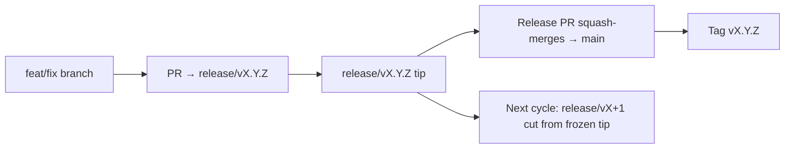

# Branching & Release Model

OmniRoute uses a **parallel-cycle** release model: a dedicated `release/vX.Y.Z`
branch for the active cycle, `main` for the published line, and an immutable
`vX.Y.Z` tag when that cycle ships. Seeing commits land on `release/*` *and* on
`main` is expected — not a mix-up.

Maintainer detail lives in `CLAUDE.md` (Hard Rule #21) and
[RELEASE_CHECKLIST.md](./RELEASE_CHECKLIST.md). This page is the public
contributor-facing summary.

## At a glance

| Ref | Role |
| --- | --- |
| `release/vX.Y.Z` | **Active cycle** — day-to-day development and PR merges for that version |
| `main` | **Published line** — receives the cycle via squash-merge when the release ships |
| `vX.Y.Z` (tag) | **Ship marker** — immutable “what shipped” pointer cut at release time |



## Where should my PR target?

**Target the active `release/vX.Y.Z` branch — not `main`.**

1. Find the highest open `release/v*` branch (example at the time of writing:
   `release/v3.8.49`).
2. Branch from that tip (`git fetch` + checkout / rebase onto it).
3. Open the PR with **base = that `release/vX.Y.Z`**.

`main` is not the day-to-day integration branch. PRs opened against `main`
usually need retargeting before merge.

## Release freeze (parallel cycles)

When a release is being reconciled, a marker issue labeled `release-freeze` is
opened. That **does not stop development**:

- The frozen `release/vX.Y.Z` belongs to the release captain for that ship.
- The next cycle’s `release/vX+1` is cut from the frozen tip so contributors keep
  landing work.
- Open PRs that still target the frozen branch should be **retargeted** to the
  active (highest) `release/v*` branch.

Check for an open freeze before assuming the branch you want is mergeable:

```bash
gh issue list --repo diegosouzapw/OmniRoute --label release-freeze --state open
```

Merge mechanics (owner `queue` label → Mergify) are documented in
[MERGE_TRAIN.md](./MERGE_TRAIN.md).

## Why both a branch and a tag?

| Artifact | Lifetime | Purpose |
| -------- | -------- | ------- |
| `release/vX.Y.Z` | In-flight cycle | Collects reviewed PRs, stays CI-green, is the PR base |
| Tag `vX.Y.Z` | Forever | Marks the exact bits that shipped to npm / GitHub Releases |

The branch is the workshop; the tag is the sealed package. After squash-merge to
`main`, the next cycle continues on `release/vX+1` without waiting for the prior
release PR to finish.

## Related docs

- [CONTRIBUTING.md](../../CONTRIBUTING.md) — setup, tests, PR checklist
- [RELEASE_CHECKLIST.md](./RELEASE_CHECKLIST.md) — pre-ship validation
- [MERGE_TRAIN.md](./MERGE_TRAIN.md) — merge queue and fallback train
- [RELEASE_GREEN.md](./RELEASE_GREEN.md) — keeping the release tip green
