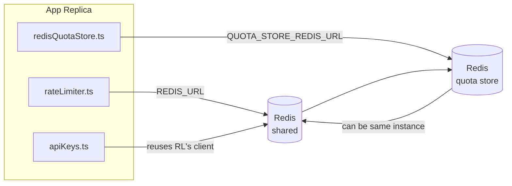

# Redis Production Configuration Guide

## Overview

Redis is an **optional, soft dependency** in OmniRoute — the application degrades gracefully (in-memory
fallbacks) when Redis is unavailable. In production, tuning Redis reduces latency for three distinct
workloads:

| Workload | Driver | Client Factory | Key Pattern |
|---|---|---|---|
| Rate limiting | `rateLimiter.ts` | `getRedisClient()` — lazy `ioredis` singleton | Lua‑atomic rate limit windows |
| Auth cache | `apiKeys.ts` | Reuses `rateLimiter`'s client | `auth:api_key:<sha256>` with TTL |
| Quota store | `redisQuotaStore.ts` | Separate `getRedisClient(url)` singleton | Configurable per-instance |

---

## Current Configuration (Code Defaults)

| Setting | Value | Where |
|---|---|---|
| `REDIS_URL` env var | `redis://redis:6379` (compose), optional | `rateLimiter.ts:5`, `.env.example` |
| `QUOTA_STORE_REDIS_URL` env var | separate, can differ from `REDIS_URL` | `quota/storeFactory.ts` |
| `QUOTA_STORE_DRIVER` | `"sqlite"` (default), `"redis"` optional | `quota/storeFactory.ts` |
| ioredis `maxRetriesPerRequest` | `3` | `rateLimiter.ts` client creation |
| `enableReadyCheck` | not set (ioredis default: `true`) | — |
| `lazyConnect` | not set (ioredis default: `false`) | — |
| `retryStrategy` | not set (ioredis default: 200ms base, exponential) | — |
| TLS / password / DB index | **not configured** | — |
| Sentinel / Cluster | **not configured** — standalone single-node only | — |

---

## Recommended Production Tuning

### 1. Connection Pool / Client Options (ioredis `Redis` constructor)

The current code creates a single `new Redis(url)` with no custom options. For production
multi‑replica deployments, pass a client factory in the code or wrap `getRedisClient()`:

```typescript
const redis = new Redis(REDIS_URL, {
  maxRetriesPerRequest: null,   // no retry limit; let retryStrategy decide
  enableReadyCheck: true,       // verify server is ready before accepting calls
  lazyConnect: true,            // don't connect on construction; wait for first call
  retryStrategy: (times) => {
    if (times > 10) return null;       // give up after 10 retries → reconnect later
    return Math.min(times * 200, 5000); // 200ms, 400ms, …, 5s cap
  },
  enableAutoPipelining: true,   // coalesce concurrent commands into one TCP write
  keepAlive: 10000,             // TCP keep‑alive every 10s
});
```

**Key trade-offs:**
- `maxRetriesPerRequest: null` + `retryStrategy` — preferred for production so transient
  Redis restarts don't immediately fail every request. The in-memory fallback in
  `checkRateLimit()` absorbs the failure path.
- `lazyConnect: true` — avoids a startup dependency on Redis being up before the server
  begins accepting connections.
- `enableAutoPipelining: true` — reduces round-trips for concurrent rate-limit checks;
  beneficial at >50 RPS on a single connection.

### 2. Redis Server Configuration (`redis.conf`)

```
# Memory
maxmemory 80%                        # leave room for OS page cache
maxmemory-policy allkeys-lru         # evict stale auth cache entries under pressure

# Persistence (optional — OmniRoute is crash‑safe without it)
save 300 1                           # snapshot at least every 5 min if ≥1 key changed
appendonly no                        # AOF not needed; data is regeneratable
appendfsync no                       # no fsync overhead (RDB is sufficient)

# Networking
timeout 0                            # no idle disconnect
tcp-keepalive 300                    # 5 min keep‑alive
tcp-backlog 511                      # connection backlog for bursty load

# Performance
hz 10                                # default; 100 for latency‑sensitive
activedefrag yes                     # auto‑defragment when fragmentation >10%
```

**Trade-off for `maxmemory-policy allkeys-lru`:** Auth cache entries may be evicted under
memory pressure. This is safe — `setCachedApiKey` always re-populates on miss, and the
SQLite fallback is authoritative. The rate-limiter Lua script creates small keys that are
short-lived by design.

### 3. Docker Compose Settings

The prod compose (`docker-compose.prod.yml`) uses `redis:8.6.2-alpine`. Add:

```yaml
redis:
  image: redis:8.6.2-alpine
  command: [
    "redis-server",
    "--maxmemory", "512mb",
    "--maxmemory-policy", "allkeys-lru",
    "--activedefrag", "yes",
    "--save", "300 1",
  ]
  healthcheck:
    test: ["CMD", "redis-cli", "ping"]
    interval: 10s
    timeout: 3s
    retries: 3
    start_period: 5s
```

### 4. Multi‑Instance / Scaling Considerations

**Single Redis for all replicas** — the rate-limiter Lua script depends on a single
authoritative key space. Multiple Redis instances behind replicas would lose atomicity
and double the budget. Use a single Redis (or Redis Sentinel cluster with failover) for
all application replicas.

**Connection count:** Each application replica opens **2 TCP connections** to Redis
(rate limiter client + quota store client). At 10 replicas → 20 connections, well
within a default Redis instance's 10k connection ceiling.

### 5. Monitoring

Expose via health-check endpoint:

```typescript
// src/app/api/monitoring/health/route.ts already calls rateLimiter functions
// Add Redis-specific checks:
//   1. PING latency via ioredis .ping()
//   2. Memory usage via INFO memory
//   3. Connection count via INFO clients
//   4. Hit rate for maxmemory-policy (evicted_keys / keyspace_hits)
```

Key metrics to watch:
- **Evicted keys / sec** — if persistently non-zero, increase `maxmemory`
- **Blocked clients** — non-zero suggests slow Lua scripts or high contention
- **Rejected connections** — connection limit hit; rare at 20 connections

---

## Architecture Diagram



---

## References

| File | Purpose |
|---|---|
| `src/shared/utils/rateLimiter.ts` | Primary Redis client, Lua rate-limit script, in-memory fallback |
| `src/lib/db/apiKeys.ts` | Auth cache — Redis→SQLite fallback |
| `src/lib/quota/redisQuotaStore.ts` | Separate Redis client for optional quota store |
| `src/lib/quota/storeFactory.ts` | Switches between `sqlite` and `redis` quota drivers |
| `docker-compose.prod.yml` | Prod Redis container (image `redis:8.6.2-alpine`) |
| `.env.example` | Redis env vars documentation |
| `src/app/api/local/redis/` | API routes for dev container orchestration |
| `bin/cli/commands/redis.mjs` | CLI commands for dev container orchestration |
